# Pixel To Page


<p align="center">
| <a href="https://pixel-to-page-b4e4b9d4d8dd.herokuapp.com/">Live Project</a> |
  <a href="https://pixel-to-page-b4e4b9d4d8dd.herokuapp.com/admin">Admin Panel</a> |
</p>
<p align="center">
 | <a href="https://github.com/TheRickyroy/pixel-to-page/blob/main/README.md">README</a> | 
  <a href="https://github.com/users/TheRickyroy/projects/3/views/1?visibleFields=%5B%22Title%22%2C%22Assignees%22%2C%22Status%22%2C%22Labels%22%5D">Project Board</a> |
  <a href="https://github.com/TheRickyroy/pixel-to-page/blob/main/documentation/testing.md">Testing</a> |
  <a href="https://github.com/TheRickyroy/pixel-to-page/blob/main/documentation/testing.md">Research</a> |
  <a href="https://github.com/TheRickyroy/pixel-to-page/blob/main/documentation/credits.md">Credits</a> |
</p>

## Introduction

_Pixel To Page_ is a blog app designed to encourage, inspire and guide programmers in the use of bullet journals.

Developed as part of Code Institute Full Stack Software Develeoper Skills Bootcamp, _Pixel To Page_ serves as my final individual assessment project to deliver a full stack application providing CRUD functionality to end users.

This README and associated documentation serve as both technical documentaion and a record of my own personal learning.

## Table of Contents

- [Pixel To Page](#pixel-to-page)
  - [Introduction](#introduction)
  - [Table of Contents](#table-of-contents)

- [UX - User Experience](#ux---user-experience)
  - [Design Ideation](#design-ideation)

- [Strategy Plane](#strategy-plane)
  - [Key Objectives](#key-objectives)
  - [Agile Methodologies](#agile-methodologies)
    - [Project Issue Status](#project-issue-status)
    - [Project Prioritisation](#project-prioritisation)

  - [User Stories](#user-stories)
    - [Epic: User Profile](#epic-user-profile)
    - [Epic: Home Page](#epic-home-page)
    - [Epic: About Page](#epic-about-page)
    - [Epic: Blog Content](#epic-blog-content)
    - [Epic: Comments](#epic-comments)
    - [Epic: Resources](#epic-resources)
    - [Epic: Community Content](#epic-community-content)

- [Scope Plane](#scope-plane)

  - [Security](#security)
    - [AllAuth](#allauth)
    - [Defensive Design](#defensive-design)
    - [CSRF Tokens](#csfr-tokens)

- [Structure Plane](#structure-plane)
  - [Database Schema](#database-schema)

- [Skeleton Plane](#skeleton-plane)
  - [Wireframes](#wireframes)

- [Surface Plane](#surface-plane)

- [Colors](#colors)
  - [Color Palette](#color-palette)
  - [Color Contrast](#contrast)
  - [Color Contrast Score Table](#color-contrast-score-table)

- [Typfaces](#typefaces)

- [Features](#features)

- [Future Scope & Features](#future-scope--features)

- [Built With](#built-with)
  - [Technology & Languages](#technology-and-languages)
  - [Frameworks & Libraries](#frameworks--libraries)
  - [Developer Tools](#developer-tools)
  - [Design Tools](#design-tools)

- [Deployment](#deployment)
  - [GitHub](#github)
    - [Repo Deployment](#repo-deployment)
    - [IDE Workspace](#ide-workspace)
      - [Via GitHub](#via-github)
      - [Via Gitpod](#via-gitpod)
    - [Fork Repo](#fork-repo)
    - [Clone Repo](#clone-repo)
  - [Django](#django)
    - [Django Project](#django-project)
    - [Django App](#django-app)
  - [Heroku](#heroku)
  - [PostgreSQL](#postgresql)
    - [Creating Your Database](#creating-your-database)
    - [Connecting to Your Database](#connecting-to-your-database)
    - [Migrating Your Database](#migrating-your-database)
  - [Cloudinary API](#cloudinary-api)
  - [Final Deployment](#final-deployment)
    - [Deploy To Remote GitHub Repo](#deploy-to-remote-github-repo)
    - [Deploy To Heroku](#deploy-to-heroku)

- [Testing](#testing)
  - [Code Validation](#code-validation)
  - [Accessibility & Audit](#accessibility--audit)
  - [Bugs](#bugs)

- [Credits](#credits)
  - [Code](#code)
  - [Media](#media)
  - [Appendices](#appendices)
  - [Acknowledgements](#acknowledgements)

<p align="right"><a href="#pixel-to-page">🔺 Back To Top</a></p>

## UX - User Experience

_Pixel To Page_ has offered a learning opportunity in how to deliver a positive user experience as part of a full stack application. 

As part of this project I set out to create a final deliverable that offered a complete experience for the end user that was enjoyable across all devices through responsivity, but also a had greater consideration of UX features that have a positive impact on accessibility.

As such my final product is slightly different to that of which I initially intended.\
This is in part due to my learning more about accessibility and user experience and thus changing design to reflect this new knowledge, but more so the alterations have come through my learning as a developer. 

Whilst implementing features I would have moments of realisation about how to more effectively use the feature, or how I could combine it with another approach in order to improve the user experience. As a result, this meant exploring many avenues of Django development that were not intended scope for this project, but I believe to be of great value to my learning and future as a developer.

This exploration has meant the implementation of many features that greatly increase the user experience, but at times have taken time from other areas of the project I wished to deliver upon in more detail, this documentation being a prime example. With this new found knowledge I believe I would be able to generate a much more concise plan for a full stack project with greater use of user stories that were reflective of feature sets and development steps.

### Design Ideation

Setting out to create a blog with a very specific intended audience I took to researching and sourcing inspiration from the conventions of both the Bullet Journal community as well as the Tech Community to establish some general conventions.

Taking these inspirations, I then began compiling basic ideas for color palette, potential layout and a list of features that would be beeneficial to the end user. 


<p align="right"><a href="#pixel-to-page">🔺 Back To Top</a></p>

## Strategy Plane

### Key Objectives

A brief bullet point list of the key objectives for _Pixel To Page_.\
This includes _learning outcomes_, _stakeholder requirements_, _personal goals_ and more.

- Fulfil the primary [Learning Objectives](documentation/learning-objectives.md) as defined by _Code Institute_.\
_NOTE: Full details in the linked documentation._
- Provide positive user experience across all devices
- Maintain a focus on accessibility for delivered project
- Document in detail the development and learning process

<p align="right"><a href="#pixel-to-page">🔺 Back To Top</a></p>

## Agile Methodologies

Following Agile Methodologies user stories were generated and compiled into a [GitHub Project Board](https://github.com/users/TheRickyroy/projects/3/views/1?visibleFields=%5B%22Title%22%2C%22Assignees%22%2C%22Status%22%2C%22Labels%22%5D)

Each story was assigned relevant labels for **MoSCoW Prioritisation**, **Epic** and **Users**

### Project Issue Status

[](https://github.com/user/repo/issues?q=is%3Aissue+is%3Aclosed)
[](https://github.com/user/repo/issues?q=is%3Aopen+is%3Aissue)

### Project Prioritisation

After ideation establish required prioritisation of tasks for **MVP** delivery.

<details>
<summary>MoSCoW Priority Color Key</summary>

| Color | Priority | MoSCoW Priority Description | Implementation % |
|:-:|:-|:-|-:|
| 🟢 | **Must Have** | Absolutely **essential** elements that must be included at any cost. | Max 60% |
| 🟡 | **Should Have** | **Important** elements that should only be included with careful consideration. | Further 20% |
| 🟠 | **Could Have** | **Desirable** elements that would ideally be included if resources allow. | Final 20% |
| 🔴 | **Won't Have** | Elements that are **out-of-scope**, **unfeasible** or actively **counterproductive** | None | 

</details>

<p align="right"><a href="#pixel-to-page">🔺 Back To Top</a></p>

## User Stories

### Epic: User Profile

| ID | User Story | MoSCoW |
|:-:|:-|:-:|
| [#1](https://github.com/TheRickyroy/pixel-to-page/issues/1) | As a _User_ I can _sign up or login_ so that _I can engage with full site functionality_. | 🟢 |
| [#2](https://github.com/TheRickyroy/pixel-to-page/issues/2) | As a _Registered User_, I can _login to my profile page_ so that _I can update my details and see previous activity_. | 🟢 |
| [#3](https://github.com/TheRickyroy/pixel-to-page/issues/3) | As a _Registered User_, I can _select notification preferences_ so that _I can be alerted about relevant content_. | 🟠 |

### Epic: Home Page

| ID | User Story | MoSCoW |
|:-:|:-|:-:|
| [#4](https://github.com/TheRickyroy/pixel-to-page/issues/4) | As a _Site Admin_, I can _update my home page_ so that _I can present users with the latest content and engage them using appropriate call to action functionality_. | 🟢 |
| [#5](https://github.com/TheRickyroy/pixel-to-page/issues/5) | As a _User_, I can _read the home page_ so that _I can easily identify new and noteworthy content_. | 🟢 |
| [#6](https://github.com/TheRickyroy/pixel-to-page/issues/6) | As a _User_, I can _toggle theme_ so that _I can have a more enjoyable experience_ | 🟡 |
| [#7](https://github.com/TheRickyroy/pixel-to-page/issues/7) | As a _User_, I can _access the website using stored theme preferences_ so that _I do not have to manually toggle each time_ | 🟠 |

### Epic: About Page

| ID | User Story | MoSCoW |
|:-:|:-|:-:|
| [#8](https://github.com/TheRickyroy/pixel-to-page/issues/8) | As a _Site Admin_, I can _update my about page_ so that _users can access and view the content I share_ | 🟢 |
| [#9](https://github.com/TheRickyroy/pixel-to-page/issues/9) | As a _User_, I can _access and read an bout page_ so that I can _better understand the author and content_ | 🟢 |

### Epic: Blog Content

| ID | User Story | MoSCoW |
|:-:|:-|:-:|
| [#10](https://github.com/TheRickyroy/pixel-to-page/issues/10) | As a _Site Admin_, I can _draft, post, update and delete blog posts_ so that _I can share my content and update as necessary_. | 🟢 |
| [#11](https://github.com/TheRickyroy/pixel-to-page/issues/11) | As a _Site Admin_, I can _categorise my blog posts_ so that _I can feature specific posts as necessary_ | 🟢 |
| [#12](https://github.com/TheRickyroy/pixel-to-page/issues/12) | As a _User_, I can _view, filter and navigate a summary of blog posts_ so that _I can access relevant content_ | 🟡 |
| [#13](https://github.com/TheRickyroy/pixel-to-page/issues/13) | As a _User_, I can _read blog posts_ so that _I can engage with relevant content_.| 🟢 |
| [#14](https://github.com/TheRickyroy/pixel-to-page/issues/14) | As a _Registered User_, I can _like & share blog posts_ so that _I can easily find previously liked posts and share content with the wider community_. | 🟠 |
| [#15](https://github.com/TheRickyroy/pixel-to-page/issues/15) | As a _User_, I can _share blog posts_ so that _I can easily share content with the wider community_. | 🟠 |

### Epic: Comments

| ID | User Story | MoSCoW |
|:-:|:-|:-:|
| [#16](https://github.com/TheRickyroy/pixel-to-page/issues/16) | As a _Site Admin_, I can _approve, deny and delete comments_ so that _I can ensure all community engagement is appropriate and follows TOS_. | 🟢 |
| [#17](https://github.com/TheRickyroy/pixel-to-page/issues/17) | As a _Registered User_, I can _comment on blog posts_ so that _I can contribute to the community and conversation_. | 🟢 |
| [#18](https://github.com/TheRickyroy/pixel-to-page/issues/18) | As a _User_, I can _read comments on blog posts_ so that _I can read the ongoing conversations_. | 🟢 |

### Epic: Resources

| ID | User Story | MoSCoW |
|:-:|:-|:-:|
| [#19](https://github.com/TheRickyroy/pixel-to-page/issues/19) | As a _Site Admin_, I can _upload resources_ so that _users can download for their own journal_. | 🔴 |
| [#20](https://github.com/TheRickyroy/pixel-to-page/issues/20) | As a _User_, I can _download resources_ so that _I can use them to improve my own journal experience_. | 🔴 |

### Epic: Community Content

| ID | User Story | MoSCoW |
|:-:|:-|:-:|
| [#21](https://github.com/TheRickyroy/pixel-to-page/issues/21) | As a _Site Admin_, I can _approve, deny and delete community posts_ so that _I can ensure all community engagement is appropriate and follows TOS_. | 🔴 |
| [#22](https://github.com/TheRickyroy/pixel-to-page/issues/22) | As a _Registered User_, I can _upload my journal images_ so that _I can share my ideas with the community and engage in feedback and conversation_. | 🔴 |

<p align="right"><a href="#pixel-to-page">🔺 Back To Top</a></p>

## Scope Plane

## Security

_Pixel To Page_ adheres to security requirements by taking advantage of already well established security procedures.

This includes the implementation of AllAuth and use of CSFR tokens.

### AllAuth

[AllAuth](https://docs.allauth.org/en/latest/) is a free, well established authentication package for Django.

Including AllAuth as part of this project allows users easy and familiar registration and associated features with the knowledge that their data is safe and secure. 

### Defensive Design

Ensuring a positive user experience _Pixel To Page_ makes use of various design features to negate potential issues for the user.
- Familiar registration user experience with AllAuth
- Navigation using conventional design, including a profile image
- Ability to create, edit and delete content through a responsive interface
- Alert and error messages providing feedback
- Auto scroll feature for ease of navigation
- Custom error pages with information and relevant links

### CSFR Tokens

CSRF (Cross-Site Request Forgery) tokens have been included as part of the project to prevent vulnerabilities to malicious attacks and ensure that only forms from trusted domains can be used to POST data back into the database. 

The code below is included as part of the deployment process on this page. 

For more information please consult the [Django Documentation](https://docs.djangoproject.com/en/5.1/ref/csrf/). 

``` Python
CSRF_TRUSTED_ORIGINS = [
    "https://*.codeinstitute-ide.net",
    "https://*.herokuapp.com"
]
```

<p align="right"><a href="#pixel-to-page">🔺 Back To Top</a></p>

## Structure Plane

## Database Schema

As part of the development process for _Paper To Pixels_ it was important to understand and fully develop the architecture in advance in hopes of minimising potential issues during the PostgreSQL Database implementation avoid retrofitting requirements.

I used [Lucid Chart](www.lucidchart.com/) to compile my **Entity Relationship Diagram (ERD)**.

Within the ERD I identified each of the models and their relationships required for my MVP.

I have also included models that were part of my user stories for features of future scope for the project, and as such have given each table an appropriate label that corresponds to the [MoSCoW Prioritisation](#project-prioritisation).

After creating the ERD I exported a PNG with transparency which was then modified using [Affinity Photo 2](https://affinity.serif.com/en-gb/) and exported in WEBP format.

During development I gained a much better understanding of how to build a full stack project and how to effectively utilise my database models. 

As a result of thise I have included a number of models that allow for input of data that can be utilised by the admin for the update of content on the home page without requiring access to the code. The intention is for these to be included within a front end for in the future, along with forms applicable to authors to generate post content. 

My other database models have also been updated to include additional data for ease of usability and implementation of future scope features.


<details><summary>Initial ERD</summary>


</details>


<p align="right"><a href="#pixel-to-page">🔺 Back To Top</a></p>

## Skeleton Plane

<p align="right"><a href="#pixel-to-page">🔺 Back To Top</a></p>

### Wireframes

Initially my wireframes had been designed within Figma.\
Unfortunately, whether due to fault of my own or technical issues within Figma, my account had been reset to the default status thus remving the wireframes I had been using / modifying for the project. 

I plan to attempt to recover these, but for the process of submission I chose to quickly recreate the basic wireframes within Affinity Photo 2 due to time constraint and a greater level of comfort and familiarity with the tools.

Affinity Photo 2
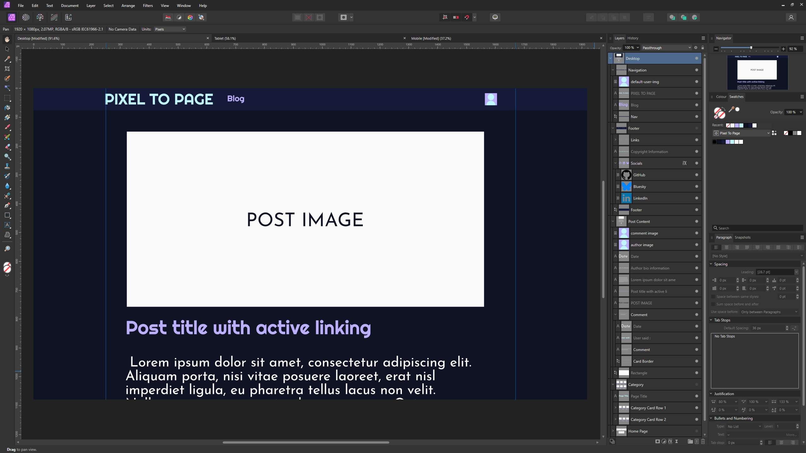

<details><summary>Desktop</summary>

Home
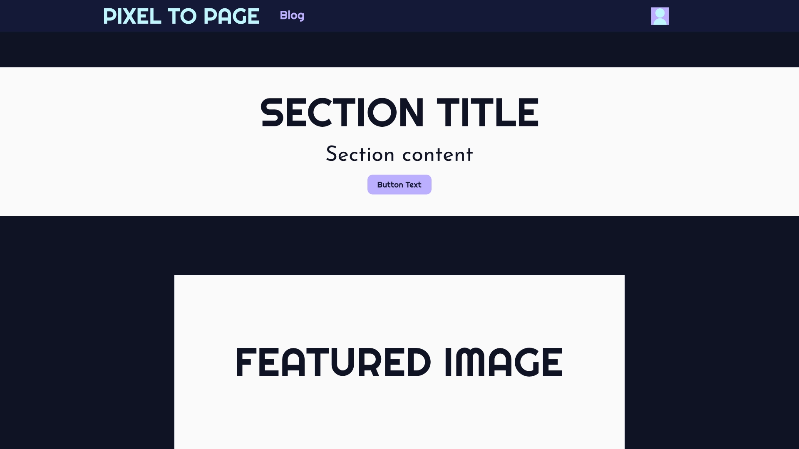

Home Footer
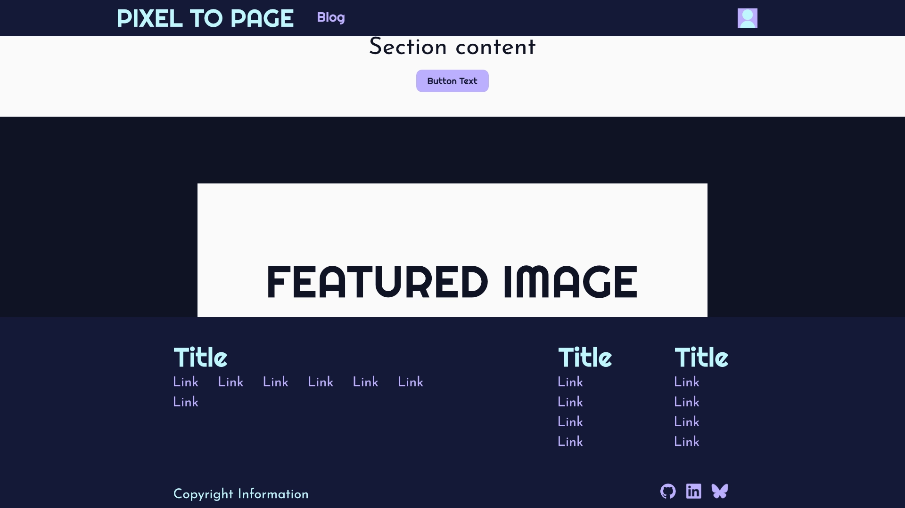

Category
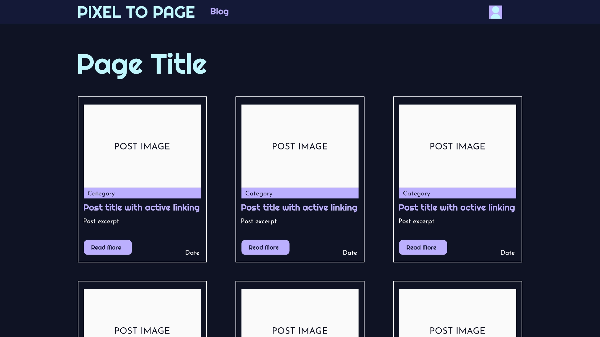

Post Detail
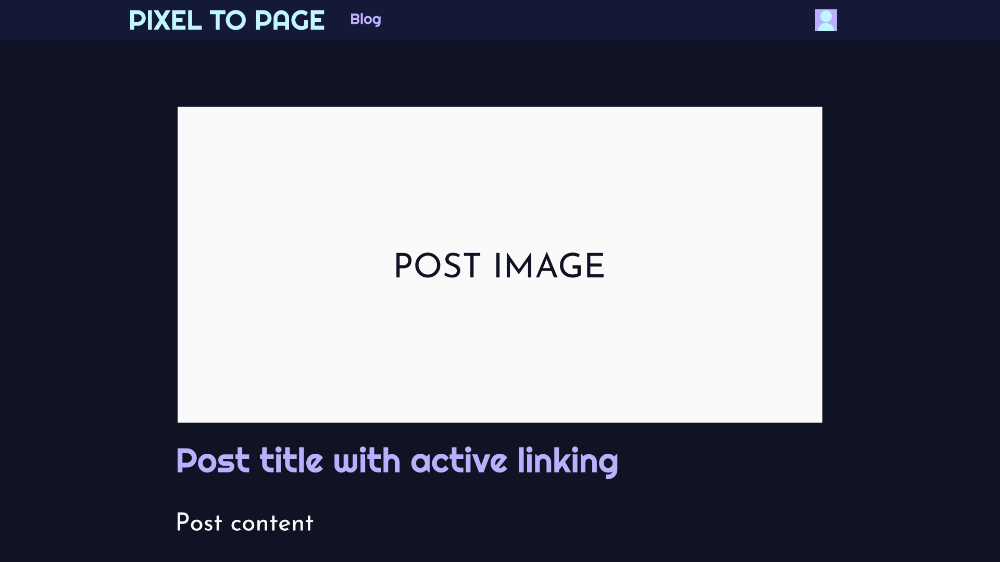

Post Comment
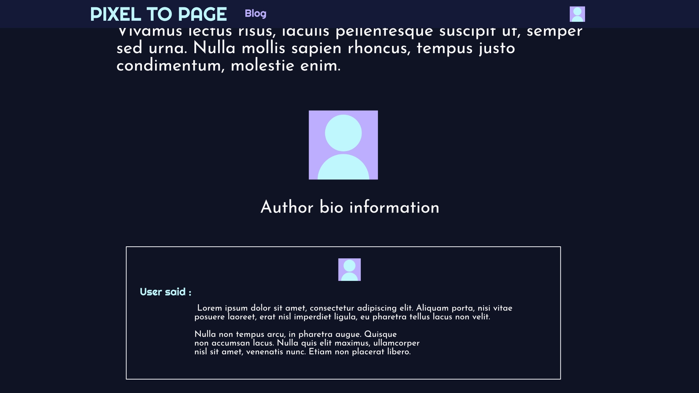

</details>

<details><summary>Tablet</summary>

Home
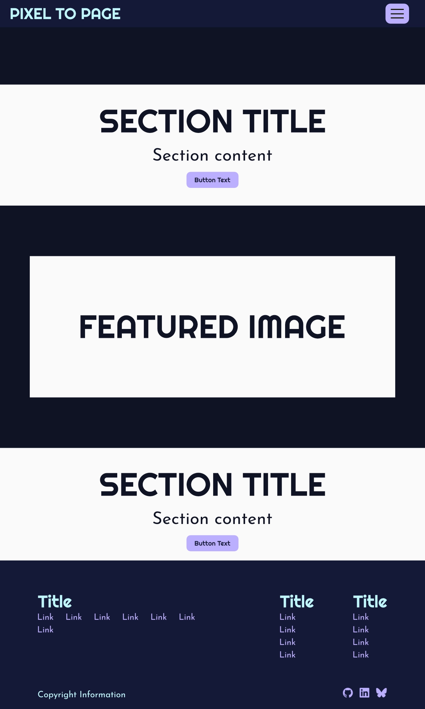

Category
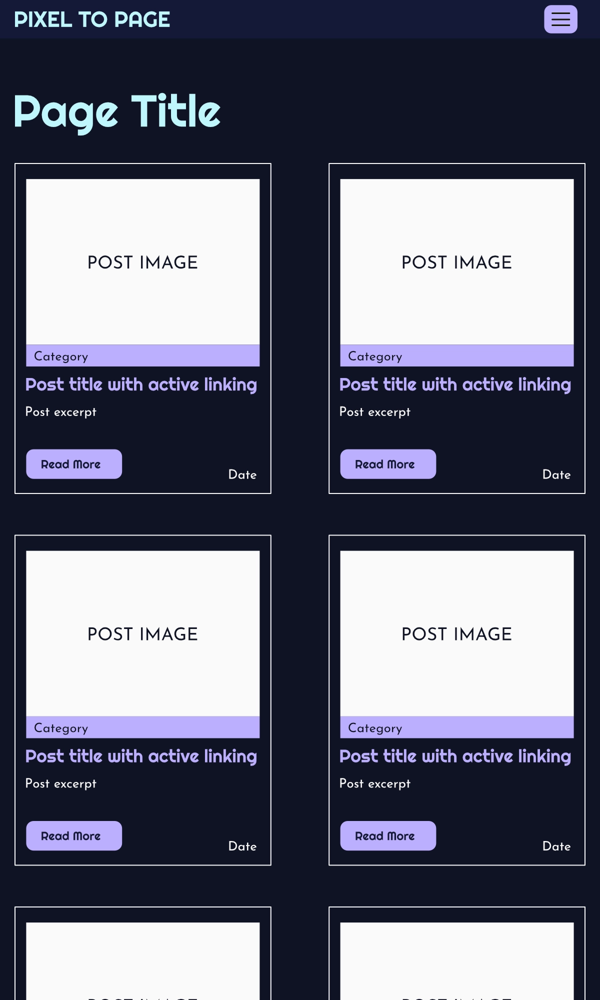

Category Navbar
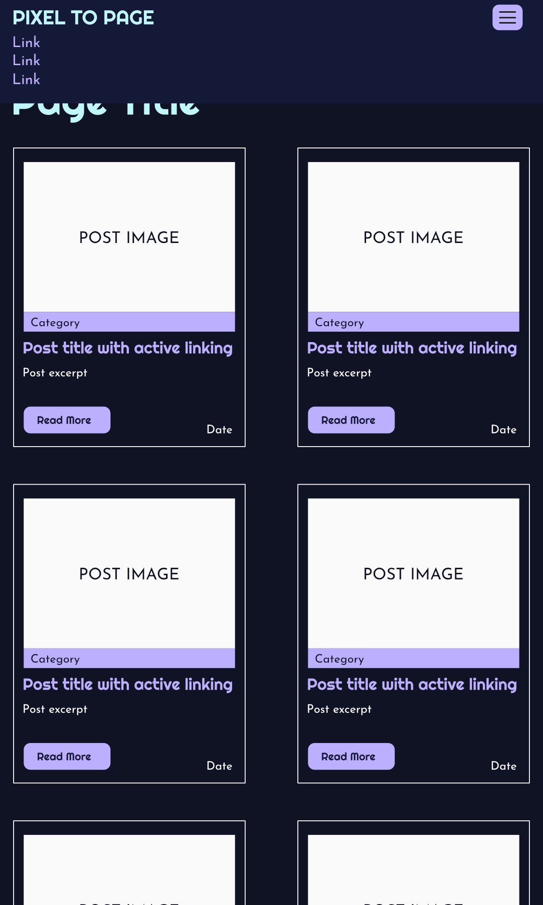

Post Detail
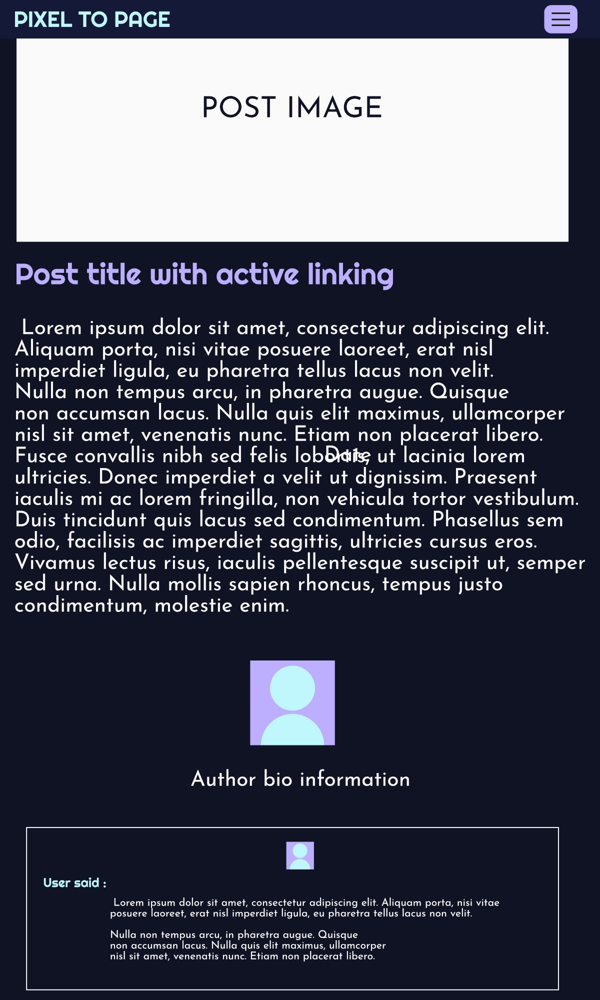

</details>


<details><summary>Mobile</summary>

Home Footer
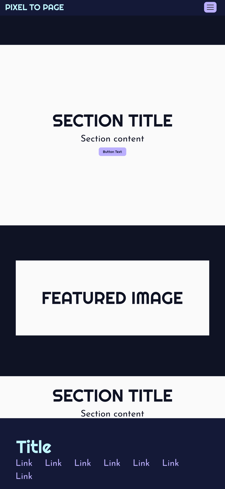

Category Navbar & Footer


Post Detail
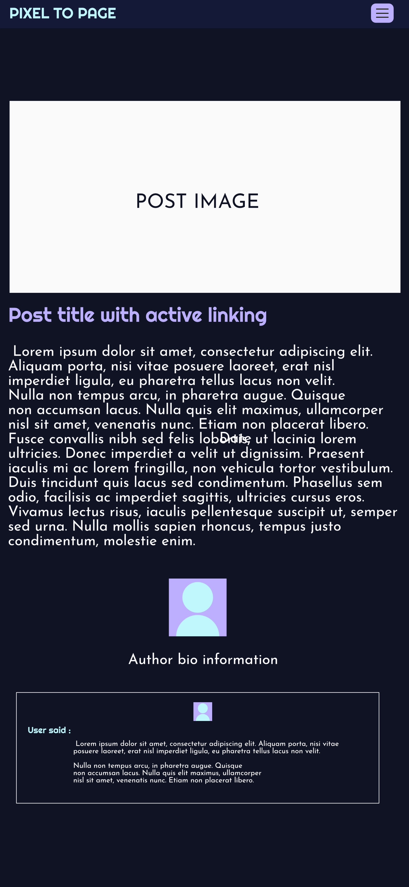

</details>


<p align="right"><a href="#pixel-to-page">🔺 Back To Top</a></p>

## Surface Plane

## Colors

### Color Palette

Through much deliberation, trial and error and sourcing of inspirational images and palettes, I finally chose this palette for a number of reasons. 

**Dark Theme - Winter Palette**

| ID | Name | Type | CSS Variable | HSL | HEX |
|:-:|:-|:-|:-|:-|:-|
| 1 | Seasalt | - | `--color-text` | hsl(0, 0%, 98%) | #FAFAFA |
| 2 | Rich Black | - | `--color-background` | hsl(229, 41%, 5%) | #070912 |
| 3 | Rich Black | - | `--color-background-muted` | hsl(229, 41%, 10%) | #0F1324 |
| 4 | Celeste | - | `--color-heading` | hsl(186, 91%, 87%) | #BFF6FC |
| 5 | Mauve | - | `--color-accent` | hsl(251, 100%, 84%) | #BDAEFF |

<br>

<details><summary>Initial Unused Palette</summary>

My initial color palette before adding styling and opting to refine.\
Variables had not yet been assigned and the inclusion of lch was present whilst researching color spaces.

| ID | Name | Type | CSS Variable | LCH | HSL | HEX |
|:-:|:-|:-|:-|:-|:-|:-|
| 1 | White | - | `--color-` | lch(100% 0 0) | hsl(0, 0%, 100%) | #FFFFFF |
| 2 | Seasalt | - | `--color-` | lch(98.27% 0 0) | hsl(0, 0%, 98%) | #FAFAFA |
| 3 | Celeste | - | `--color-` | lch(93.26% 19.23 207.57) | hsl(186, 91%, 87%) | #BFF6FC |
| 4 | Mauve | - | `--color-` | lch(74.65% 42.62 295.44) |hsl(251, 100%, 84%) | #BDAEFF |
| 5 | Prussian Blue | - | `--color-` | lch(16.05% 15.32 257.06) | hsl(208, 49%, 16%) | #152A3D |
| 6 | Rich Black | - | `--color-` | lch(6.14% 12.54 280.34) |hsl(229, 41%, 10%) | #0F1324 |
| 7 | Black | - | `--color-` | lch(0% 0 0) | hsl(0, 0%, 0%) | #000000 |


| | White | Seasalt | Celeste | Mauve | Prussian<br>Blue | Rich<br>Black | Black |
|-:|:-|:-|:-|:-|:-|:-|:-|
| **White** | - | 🔴 [1.04:1](https://webaim.org/resources/contrastchecker/?fcolor=FFFFFF&bcolor=FAFAFA) | 🔴 [1.17:1](https://webaim.org/resources/contrastchecker/?fcolor=FFFFFF&bcolor=BFF6FC) | 🔴 [1.96:1](https://webaim.org/resources/contrastchecker/?fcolor=FFFFFF&bcolor=BDAEFF) | 🟢 [14.68:1](https://webaim.org/resources/contrastchecker/?fcolor=FFFFFF&bcolor=152A3D) | 🟢 [18.43:1](https://webaim.org/resources/contrastchecker/?fcolor=FFFFFF&bcolor=0F1324) | 🟢 [21:1](https://webaim.org/resources/contrastchecker/?fcolor=FFFFFF&bcolor=000000) |
| **Seasalt** | 🔴 [1.04:1](https://webaim.org/resources/contrastchecker/?fcolor=FAFAFA&bcolor=FFFFFF) | - | 🔴 [1.13:1](https://webaim.org/resources/contrastchecker/?fcolor=FAFAFA&bcolor=BFF6FC) | 🔴 [1.88:1](https://webaim.org/resources/contrastchecker/?fcolor=FAFAFA&bcolor=BDAEFF) | 🟢 [14.06:1](https://webaim.org/resources/contrastchecker/?fcolor=FAFAFA&bcolor=152A3D) | 🟢 [17.66:1](https://webaim.org/resources/contrastchecker/?fcolor=FAFAFA&bcolor=0F1324) | 🟢 [20.11:1](https://webaim.org/resources/contrastchecker/?fcolor=FAFAFA&bcolor=000000)  |
| **Celeste** | 🔴 [1.17:1](https://webaim.org/resources/contrastchecker/?fcolor=BFF6FC&bcolor=FFFFFF) | 🔴 [1.13:1](https://webaim.org/resources/contrastchecker/?fcolor=BFF6FC&bcolor=FAFAFA) | - | 🔴 [1.66:1](https://webaim.org/resources/contrastchecker/?fcolor=BFF6FC&bcolor=BDAEFF) | 🟢 [12.44:1](https://webaim.org/resources/contrastchecker/?fcolor=BFF6FC&bcolor=152A3D) | 🟢 [15.63:1](https://webaim.org/resources/contrastchecker/?fcolor=BFF6FC&bcolor=0F1324) | 🟢 [17.8:1](https://webaim.org/resources/contrastchecker/?fcolor=BFF6FC&bcolor=000000)  |
| **Mauve** | 🔴 [1.96:1](https://webaim.org/resources/contrastchecker/?fcolor=BDAEFF&bcolor=FFFFFF) | 🔴 [1.88:1](https://webaim.org/resources/contrastchecker/?fcolor=BDAEFF&bcolor=FAFAFA) | 🔴 [1.66:1](https://webaim.org/resources/contrastchecker/?fcolor=BDAEFF&bcolor=BFF6FC) | - | 🟢 [7.45:1](https://webaim.org/resources/contrastchecker/?fcolor=BDAEFF&bcolor=152A3D) | 🟢 [9.36:1](https://webaim.org/resources/contrastchecker/?fcolor=BDAEFF&bcolor=0F1324) |🟢 [10.66:1](https://webaim.org/resources/contrastchecker/?fcolor=BDAEFF&bcolor=000000) |
| **Prussian Blue** | 🟢 [14.68:1](https://webaim.org/resources/contrastchecker/?fcolor=152A3D&bcolor=FFFFFF) | 🟢 [14.06:1](https://webaim.org/resources/contrastchecker/?fcolor=152A3D&bcolor=FAFAFA) | 🟢 [12.44:1](https://webaim.org/resources/contrastchecker/?fcolor=152A3D&bcolor=BFF6FC) | 🟢 [7.45:1](https://webaim.org/resources/contrastchecker/?fcolor=152A3D&bcolor=BDAEFF) | - | 🔴 [1.25:1](https://webaim.org/resources/contrastchecker/?fcolor=152A3D&bcolor=0F1324) | 🔴 [1.43:1](https://webaim.org/resources/contrastchecker/?fcolor=152A3D&bcolor=000000) |
| **Rich Black** | 🟢 [18.43:1](https://webaim.org/resources/contrastchecker/?fcolor=0F1324&bcolor=FFFFFF) | 🟢 [17.66:1](https://webaim.org/resources/contrastchecker/?fcolor=0F1324&bcolor=FAFAFA) | 🟢 [15.63:1](https://webaim.org/resources/contrastchecker/?fcolor=0F1324&bcolor=BFF6FC) | 🟢 [9.36:1](https://webaim.org/resources/contrastchecker/?fcolor=0F1324&bcolor=BDAEFF) | 🔴 [1.25:1](https://webaim.org/resources/contrastchecker/?fcolor=0F1324&bcolor=152A3D) | - | 🔴 [1.13:1](https://webaim.org/resources/contrastchecker/?fcolor=0F1324&bcolor=000000) |
| **Black** | 🟢 [21:1](https://webaim.org/resources/contrastchecker/?fcolor=000000&bcolor=FFFFFF) | 🟢 [20.11:1](https://webaim.org/resources/contrastchecker/?fcolor=000000&bcolor=FAFAFA) | 🟢 [17.8:1](https://webaim.org/resources/contrastchecker/?fcolor=000000&bcolor=BFF6FC) | 🟢 [10.66:1](https://webaim.org/resources/contrastchecker/?fcolor=000000&bcolor=BDAEFF)  | 🔴 [1.43:1](https://webaim.org/resources/contrastchecker/?fcolor=000000&bcolor=152A3D) | 🔴 [1.13:1](https://webaim.org/resources/contrastchecker/?fcolor=000000&bcolor=0F1324) | - |

</details><br>

**Preference & Inspiration**\
As _Pixel To Page_ is intended to encourage programmers away from the screen to engage in creative tactile note taking, I drew inspiration from images I find to be beneficial for myself when seeking those creative motivations. As many of these images were landscape photography including mountains, lakes and other environments, I opted to also include the upcoming winter season as part of the initial theme for this project, with the intention of updating as the seasons change.

I used these images to extract a plethora of color palettes using Adobe's [Color Theme From Image](https://color.adobe.com/create/image) functionality and began to mix and match them according to my own preferences and contrast requirements.

**Community Convention**\
As mentioned I opted to use the seasons as part of the selection process for the chosen palette, something that is very common among the bullet journal community. Continuing this approach and taking inspiration from the wider community I also chose to adopt a common convention of using more muted, pastel like tones which is popular, especially among _Bullet Journal_ blogs. Although the specific approach for the websites is aimed toward programmers, I also opted to make the primary theme a dark theme, with the intention to implement an alternate light theme that would be more conventional to the bullet journal community. 

<p align="right"><a href="#pixel-to-page">🔺 Back To Top</a></p>

### Color Space

Though HEX is a commonly used color space within programming, and one I am comfortable using after doing so for many years, I have opted to adopt a different approach for _Pixel To Page_ and shall be using HSL. This decision has been made as a result of my learning throughout the Bootcamp, as well as much supplemental reading and learning.

Reading articles via [daily.dev](https://daily.dev/), particularly with regards to _UX_, _UI_, _CSS_, _Front End_ and _Accessibility_, I began finding more information about recent changes and aditions available ans began to explore new posibilities opening up for developers in terms of styling and continued my research in hopes of learning more. 

This brought me to the final decision of implementing HSL as my chosen color space, although I would like to pursue LCH in the future once I am more confident it is fully supported across all devices and broswers due to its increased color range and flexability.

<p align="right"><a href="#pixel-to-page">🔺 Back To Top</a></p>

### Contrast

- [Colour Contrast Checker](https://colourcontrast.cc/) also has [Chrome Extension](https://chromewebstore.google.com/detail/colour-contrast-checker/nmmjeclfkgjdomacpcflgdkgpphpmnfe)

### Color Contrast Score Table

To corroborate the results from [Colour Contrast Checker](https://colourcontrast.cc/), each combination has also be checked using [Adobe](https://color.adobe.com/create/color-contrast-analyzer) and [WebAIM](https://webaim.org/resources/contrastchecker/).

The table provides the contrast ratio score for each color combination used and a link to the [WebAIM](https://webaim.org/resources/contrastchecker/) results page is also provided. I have also opted to include a key to quickly identify the pass rating of each color combination, which in this case due to the focus on accessiblity, has resulted in a full pass state for the intended combinations and no patial passes. 

<details><summary>WCAG Color Contrast Score Key</summary>

| | Pass All | Partial | Partial |Fail All |
|-:|:-:|:-:|:-:|:-:|
| **Contrast Score** | > 7:1 | > 4.5:1 | > 3:1 | < 3:1 |
| **Color Key** | 🟢 | 🟡 | 🟠 | 🔴 |

</details>

| | Text | Highlight | Accent |
|-:|:-|:-|:-|
| **Background** |🟢 [19.03:1](https://webaim.org/resources/contrastchecker/?fcolor=FAFAFA&bcolor=070912)|🟢 [16.84:1](https://webaim.org/resources/contrastchecker/?fcolor=BFF6FC&bcolor=070912)|🟢 [10.08:1](https://webaim.org/resources/contrastchecker/?fcolor=BDAEFF&bcolor=070912)|
| **Background Muted** |🟢 [17.66:1](https://webaim.org/resources/contrastchecker/?fcolor=FAFAFA&bcolor=0F1324)|🟢 [15.63:1](https://webaim.org/resources/contrastchecker/?fcolor=BFF6FC&bcolor=0F1324)|🟢 [9.36:1](https://webaim.org/resources/contrastchecker/?fcolor=BDAEFF&bcolor=0F1324)|

<p align="right"><a href="#pixel-to-page">🔺 Back To Top</a></p>

## Typefaces

I have opted to use clean sans-serif fonts as part of my design for both their aestetic appeal, especially as part of the tech community, but also due to their value as typefaces for accessibility.

- [Righteous](https://fonts.google.com/specimen/Righteous) - Brand / Headings
- [Josefin Sans](https://fonts.google.com/specimen/Josefin+Sans) - Primary Body

<p align="right"><a href="#pixel-to-page">🔺 Back To Top</a></p>

## Features

This section should be used to showcase the features of the final _project_.

This heading provides an overview of a general feature group, providing context and description.

<details><summary>Alert Messages</summary>

Upon user interaction immediate feedback messages are provided detailing the interaction. 

As a consideration for accessibility these messages remain on screen until the user opts to remove them. This decision was made as result of learning more about how timed interactions cause issues for users with reduced motor function.


</details>

<details><summary>Post Category</summary>

As part of the post category page I chose to include all posts within cards that are fully responsive across devices. 

At the top of the page is a responsive list that updates based upon categories within the database and will highlight the current page to the user identifying the categopry they are viewing. 

Each card contains a featured image, which if not set for the post will default to the category image.\
These images include alt text that can be input as part of the admin intercae to ensure accessibility is met.

Within the **All Posts** category page each card includes a direct link to the category beneath the image.

The title of the post directly links to the post detail page, as well as being able to use the read more button provided.

The post date is included for the user to ensure to ensure they can easily identify the post irder and find the latest most relevant content.

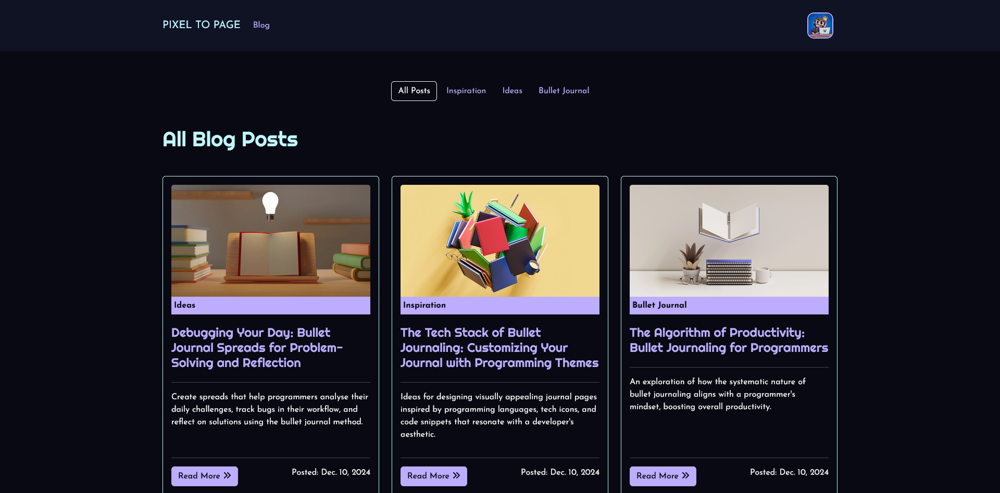

</details>

<details><summary>Comments</summary>

As part of the post detail page registered users are able to engage with the content and post comments.

This comment card includes the user profile image, which has a default if no image is provided. 

The card includes the user's display name, but will revert to username if no display name is provided.

Upon clicking to edit a comment, the user will be automatically scrolled to the form field to make their desired changes.

Comments can be easily deleted but provide a confirmation modal to ensure no accidental changes occur. 

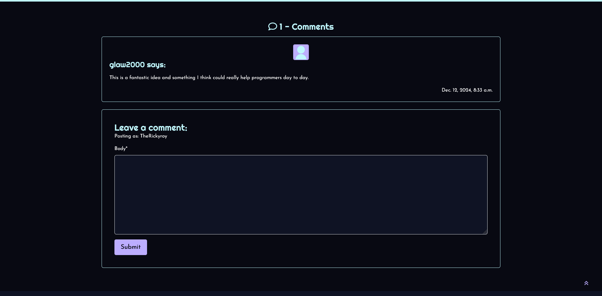

</details>

<details><summary>Call To Action</summary>

As part of the main page there are various call to actions available. 

These update automatically to reflect the user logged in status ensuring they are seeing relevant content.

Each aspect of the section can be easily updated within the admin panel, with the option of creating new cta / signup cards without publishing. 

When wishing to activate a card, defensive design is implemented as part of the database to ensure that all other forms are deactivated upon activation of the desired card. 

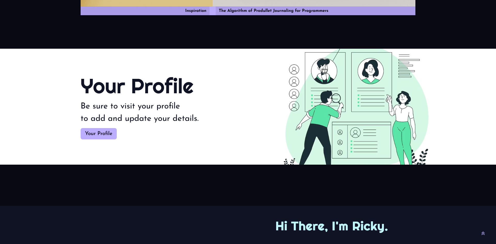

</details>

<details><summary>Edit Profile</summary>

As part of the design for user interaction, users are able to update their information that will be used to populate features across the site. Currently the profile image and username and bio for authors. 

Form inputs have a focus color change to easily identify the current location being edited.

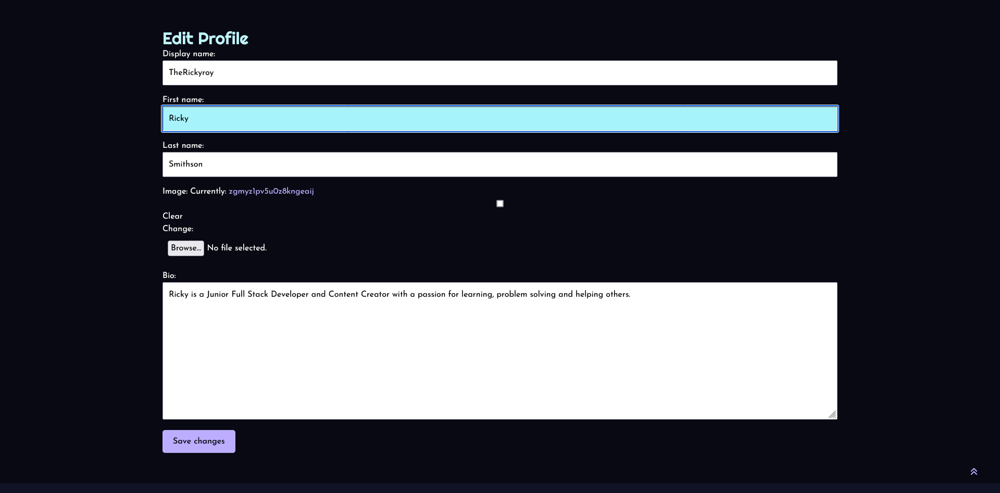

</details>

<details><summary>Featured Posts</summary>

The home page includes a featured post bootstrap carousel. 

These posts can be easily changed out within the admin panel by using the featured status check as part of the post panel.

This ensure users are provided with the latest and most relevant content.

The carousel provides direct links to the post, detail about the title and category as well as a visual change for hover effect to indicate the availablity of the link to the user.

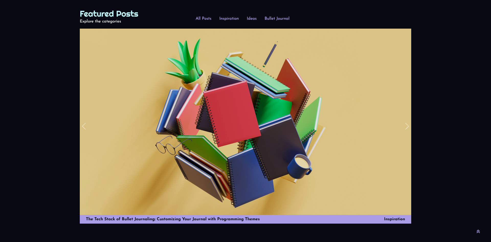

</details>

<details><summary>Footer</summary>

The footer includes a category section that updates with content as created in the admin panel. 

Various other links have been provided including credits to sources for the project.

Social links provide access to my accounts on GitHub, Bluesky and LinkedIn for those wishing to conect.

The copyright date is auto populated with the current year, which will be updated to state 2024-current once 2025 arrives.

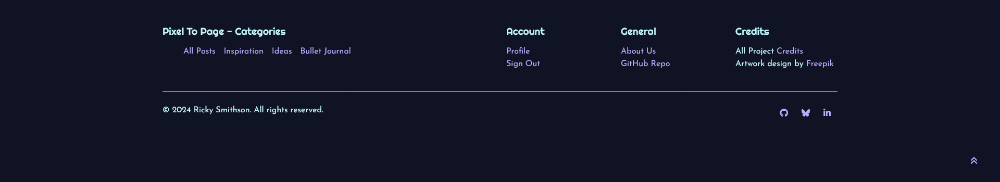

</details>

<details><summary>Home Page</summary>

The Home Page greets the user with a bright hero image section that introduces the site and links to a relevant page, in this case all posts. As with the call to action section, this hero section can be easily updated and toggled active within the admin panel.

Category links are present as part of the featured posts section to provide easy navigation, especially useful to mobile users who can quickly ;link through without the use of the hamburger menu.

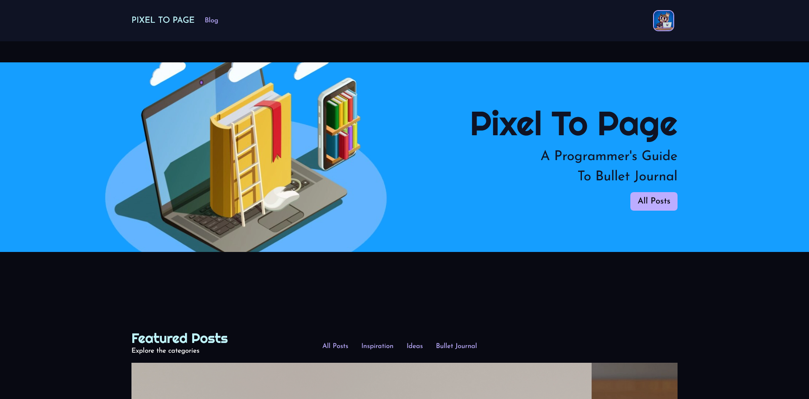

</details>

<details><summary>Info</summary>

This info section has been included as a replacement for the about page that was initially intended as part of this project.

It offers the user an insight into the project and provides a link to relevant content.
Currently it links to All Posts.

As with the hero and call to action, this can be easily updated from the admin panel. 

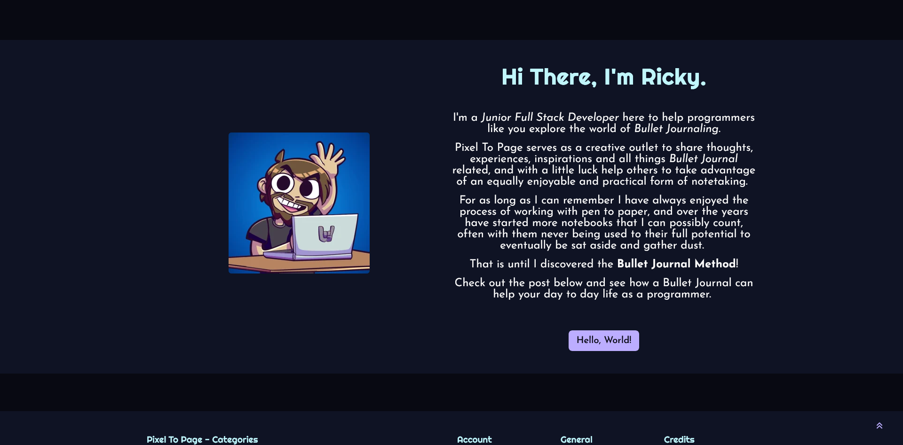

</details>

<details><summary>Navbar</summary>

The navbar as standard provides the user with an easy to navigate menu that utilises effective styling to encourage the sign up process. 

Upon login the navbar updates to reflect this status and provides the user with a previes of their profile image. 
This image can be updated easily using a Cloudinary upload, but defaults to a standard image if none is set. 

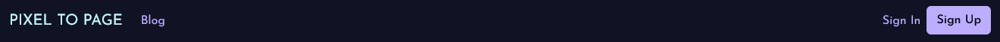


</details>

<details><summary>Post Call To Action</summary>

As part of post detail view I have included a series of call to action elements.

Previous and next post links are provided in form of a post title with font-awesome angles icon.
These update based upon the content within the database / on page and will navigate through all posts in a chronological order.

The author section provides some basic information about the post author. The intention for this is to replace the original about page and provide author profile pages as part of a future implementation. This data is populated from the profiles database model which includes a boolean field for author status. Upon implementation authors would gain the relevant access to created, update and delete posts within a front end form abd their user data would automatically populate this section of the page. 

A simple set of category links are provided with a call to action prompt to encourage further engagement and reading of content. 

The post comment count has been included here also as it helps to identify comments below being present without the need to scroll, thus encouraging further engagement and conversation.

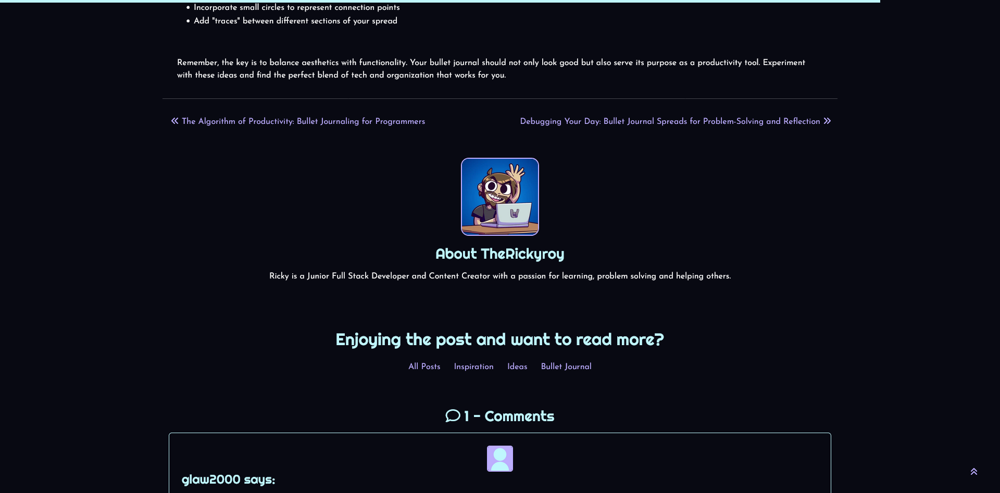

</details>

<details><summary>Profile</summary>

The user profile page provides a clean interface for users to identify the data currently associated with their profile.

Links are provided to the edit page as well as other user interactions such as change pass word and sign out.

These pages would be updated in the future to also include author status, links to posts made/liked and any comments the user has made.

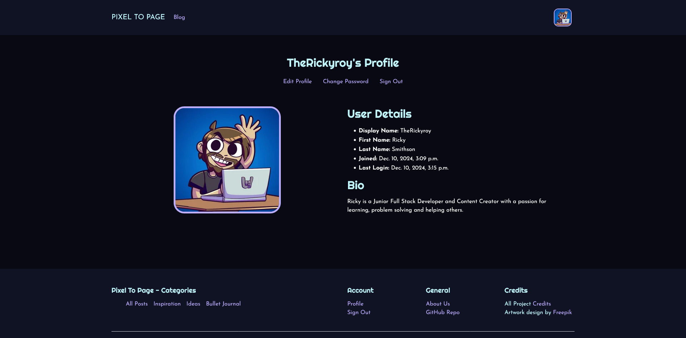

</details>

<details><summary>Scrollbar</summary>

On the post detail page I have opted to include a scrollbar.

This has been included to provide a positive user experience with interaction feedback allowing the user to easily identify how much of the content they have read / is remaining. 

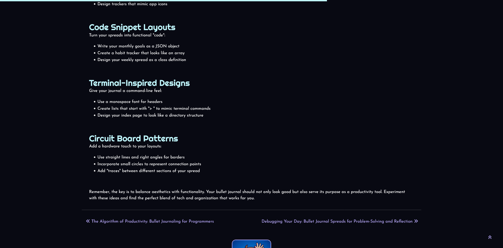

</details>

<details><summary>Sign In</summary>

The user sign in page as with other form inputs changes colour to provide feedback to the user.

Familiar responsive form elements are provided to ease the sign in process. 

Information and a relevant link are also provided for users that may wish to sign up if they do not have an account to sign in currently.

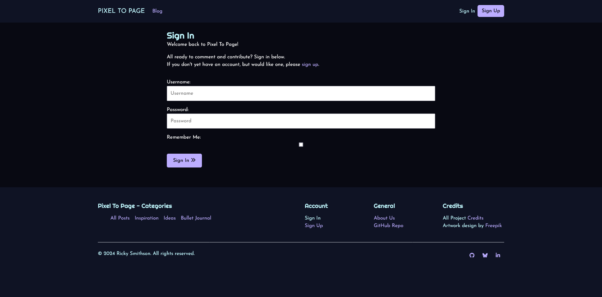

</details>

<details><summary>Sign Out</summary>

As with other AllAuth intraction pages, users are provided with a familar form for positive user experience.

Upon sign out the user is returned to the home page with an alert message confirming the sign out has taken place.

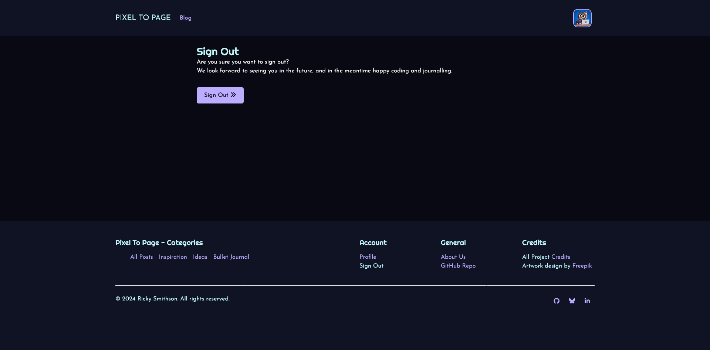
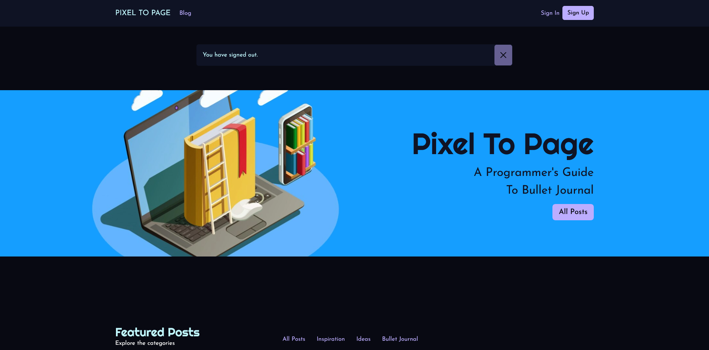

</details>

<details><summary>Sign Up</summary>

The sign up page uses the same form design as other pages.

Upon form submission if any required elements are not met the user receives an updated message on screen on how to rectify the issue. This is provided as part of AllAuth and as such is a familiar inteface used across many websites. 

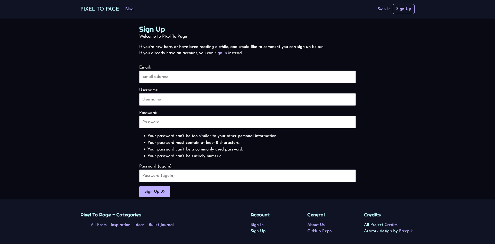

</details>

<details><summary>Error</summary>

As part of defensive design pages have been included for the 404, 404 and 500 error messages.

Each page provides the user with information regarding the error and offers potential navigation options to other areas of the website.

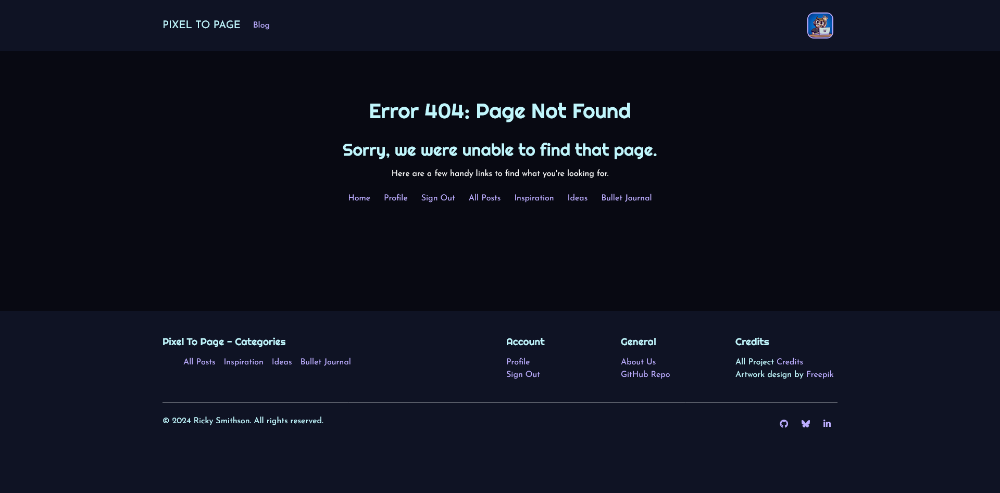

</details>

<p align="right"><a href="#pixel-to-page">🔺 Back To Top</a></p>

## Future Scope & Features

With the completion of the project describe potential future implementations.\
These could be outstanding issues, or new ideas that developed over the course of the project.

| Title | Description |
|:-:|:-|
| Feature | A desirable feature to be included in future scope implementation |

<p align="right"><a href="#pixel-to-page">🔺 Back To Top</a></p>

## Built With

### Technologies & Languages

[](https://www.djangoproject.com/)
[](https://www.postgresql.org/docs/release/)

[](https://developer.mozilla.org/en-US/docs/Web/HTML)
[](https://developer.mozilla.org/en-US/docs/Learn/CSS)
[](https://developer.mozilla.org/en-US/docs/Web/JavaScript)
[](https://www.python.org/doc/)

### Frameworks & Libraries
[](https://docs.allauth.org)
[](https://pypi.org/project/cloudinary/)
[](https://django-crispy-forms.readthedocs.io/en/latest/)
[](https://gunicorn.org/)
[](https://pypi.org/project/psycopg2/)
[](https://pypi.org/project/psycopg2/)
[](https://whitenoise.readthedocs.io/en/stable/index.html)

[-grey?logo=okta&logoColor=%23ffffff&color=%23ff6400)](https://github.com/Code-Institute-Org/ci-full-template)

### Developer Tools
[](https://www.gitpod.io/)
[](https://github.com/)
[](https://www.heroku.com/)

[](https://www.perplexity.ai/)
[](https://obsidian.md)
[](https://slack.com)
[](https://www.lucidchart.com)

[](https://learn.microsoft.com/en-us/windows/powertoys/)
[](https://www.elgato.com/uk/en/s/downloads)

### Design Tools
[](https://affinity.serif.com/en-gb/)
[](https://affinity.serif.com/en-gb/)
[](https://www.figma.com/release-notes/)
[](https://learn.microsoft.com/en-us/windows/powertoys/)

<p align="right"><a href="#pixel-to-page">🔺 Back To Top</a></p>

## Deployment

The following deployment process uses guidelines and tools as provided by [Code Institute](https://codeinstitute.net/).

- Code provided may refer to this specific project, or generic examples, requiring modification during your own deployment.
- This deployment process is version specific in many cases and does not default to the latest available version.
- If at any stage you are unable to access or perform the required steps, please consult relevant documentation / support for your platform / tool.

## GitHub

### Repo Deployment

1. Login / Signup at [GitHub](https://github.com/).
2. Navigate to the [Code Institute Full Template](https://github.com/Code-Institute-Org/ci-full-template).\
_NOTE:_ Version used for this project last updated **2024-06-18**
3. Click **'Use this template'** followed by **'Create a new repository'** in the drop-down menu.

4. Input the details for your repository.
  - Repository Name (mandatory).
  - Repository Description (optional).
  - Ensure repo is set to **'Public'**.
  - Click **'Create repository'**.

<p align="right"><a href="#pixel-to-page">🔺 Back To Top</a></p>

### IDE Workspace

The IDE Workspace for this project has been created and hosted on [Gitpod](https://www.gitpod.io/) via [Code Institute](https://codeinstitute.net/).

**IMPORTANT** Once you have your IDE Workspace in Gitpod, be sure to pin it to retain your virtual environment throughout the course of the project.

### Via GitHub

1. Navigate to your new repository.
2. Click on the **'Open'** button also identified with the Gitpod icon.

### Via Gitpod

1. Navigate to [Code Institute Gitpod](https://codeinstitute-ide.net/workspaces).
2. Click **'New Workspace'** or press **'Ctrl + O'**.
3. Search for your project repository.
4. Click **'Continue'** or press **'Ctrl + Enter'**.

<p align="right"><a href="#pixel-to-page">🔺 Back To Top</a></p>

### Fork Repo

To create a for of this project navigate the the top level of the [Repo](https://github.com/TheRickyroy/pixel-to-page).

1. Navigate to the **'Code*** tab.
2. Click the drop-down menu to the right of the **'Fork'** button.
3. Click **'+ Create a new fork'**.
4. Using the forked repo in your GitHub account follow the deployment steps on this page.

<p align="right"><a href="#pixel-to-page">🔺 Back To Top</a></p>

### Clone Repo

To create a local clone of this project, navigate to the top level of the [Repo](https://github.com/TheRickyroy/pixel-to-page).

1. Navigate to the **'Code'** tab.
2. Click the drop-down to the right of the **'Code'** button.
3. Select you preferred cloing method **HTTPS**, **SSH** of **GitHub CLI** and copy the URL using the **'Copy'** button.
4. Open the bash terminal in your local workspace. 
5. Ensure your working directory is the correct location for your cloned repository.
6. In the terminal execute command `git clone <URL>` replacing URL with the one copied in step 3.
7. Press **'Enter'** to clone the repository. 
8. Using the `pip3 install -r requirements.txt` command install the project dependencies.
9. Using the deployment steps on this page setup your **env.py** file for Cloudinary and PostgreSQL.
10. Add the **env.py** file to **.gitignore** and continue following deployment steps for Django.

<p align="right"><a href="#pixel-to-page">🔺 Back To Top</a></p>

## Django

### Django Project

All commands unless otherwise stated are performed within the IDE Workspace bash terminal. 

1. Install Django (using the latest 4.2 version).
```
pip3 install Django~=4.2.1
```

2. Create the **requirements.txt** file in the root directory.
```
pip3 freeze --local > requirements.txt
```

3. Create your Django project with an appropriate name.
```
django-admin startproject pixel_to_page .
```
- **Important** - ensure the ` .` is included at the end.

4. Apply pre-built Django account migrations.
```
python3 manage.py migrate
```

5. Run the server to test the install.
```
python3 manage.py runserver
```
- Click on **'Open in new browser'**.
- A new browser tab should open containing the Django project.
- Copy the INVALID HTTP_HOST header displayed on this page `'8000-therickyroy-pixeltopage-pqpue43ydq5.ws.codeinstitute-ide.net'`

6. Navigate to **settings.py** in the IDE File Explorer.
- Update the `ALLOWED_HOSTS` to include what was copied in the previous step and `'.herokuapp.com'`.
``` Python
ALLOWED_HOSTS = ['8000-therickyroy-pixeltopage-pqpue43ydq5.ws.codeinstitute-ide.net', 
                '.herokuapp.com']
```

7. Immediately below the `ALLOWED_HOSTS` add the following code to ensure your IDE and Heroku pass CSRF verification.
``` Python
CSRF_TRUSTED_ORIGINS = [
    "https://*.codeinstitute-ide.net",
    "https://*.herokuapp.com"
]
```

<p align="right"><a href="#pixel-to-page">🔺 Back To Top</a></p>

### Django App

1. Create your app assigning an appropriate name in lowercase, in this example our app is **blog**.
- This will create a your new app folder & file structure. 
```
python3 manage.py startapp blog
```

2. Navigate to **settings.py** and add your new app to `INSTALLED_APPS`
- **Note:** Other apps removed for brevity.
``` Python
INSTALLED_APPS = [
    ...
    'blog',
]
```

3. Save all files.

<p align="right"><a href="#pixel-to-page">🔺 Back To Top</a></p>

## Heroku

1. Navigate to your [Heroku Dashboard](https://dashboard.heroku.com/apps)

2. Create a new app.
- Click **'New'**.
- Click **'Create new app'** from the drop-down menu.
- Give it a unique name (for this project `pixel-to-page`).
- Select the appropriate region (for this project `Europe`).

3. Disabling collection of static files.
- Navigate to app settings .
- Click **'Reveal Config Vars'**.
- Add a new Config var.
  - Key = `DISABLE_COLLECTSTATIC`
  - Value = `1`
- Click **'Add'**.

4. Install the web server gunicorn and freeze requirements.
```
pip3 install gunicorn~=20.1
```
```
pip3 freeze --local > requirements.txt
```

5. Create a new Procfile in the root directory.
- **IMPORTANT** Ensure correct capitalisation of P for Heroku to correctly identify the file.

6. Declare the process in Procfile.
```
web: gunicorn pixel-to-page.wsgi
```

7. Add deployed app to allowed hosts.
- This stage was already covered by adding `'.herokuapp.com'`  in step 6 of the initial Django setup process.

8. Connect to GitHub Repo.
- Navigate to **Deploy** tab.
- In Deployment method, select **'GitHub: Connect to GitHub'**.
- Search for your project repo and click **'Connect'**.

9. Specify Eco Dynos for resource usage.
- Navigate to the **Resources** tab.
- Ensure your app is using Eco Dynos supplied as part of [Code Institute](https://codeinstitute.net/) (see [LMS](https://learn.codeinstitute.net/dashboard) for further details).
- Remove any Postgres DB Add-ons (this should already be empty).

<p align="right"><a href="#pixel-to-page">🔺 Back To Top</a></p>

## PostgreSQL

### Creating Your Database

1. Navigate to [CI Database Maker](https://dbs.ci-dbs.net/).
2. Input your email address and follow the instructions provided.
3. Open the received email and copy your database URL.

### Connecting to Your Database

1. Install Database Packages & freeze the requirements.
```
pip3 install dj-database-url~=0.5 psycopg
```
```
pip3 freeze --local > requirements.txt
```
- **Note:** If you have not closed your workspace you can navigate to the previous command to freeze the requirements using the up arrow in the terminal.

2. In the root directory create an **env.py** file.

3. Add `env.py` to  the **.gitignore** file.
- **Note:** This may already be added within the file.

4. Import os library to **env.py** and set the environment variables pasting in the URL provided by in your CI Database Maker email.
``` Python
import os
```
``` Python
os.environ["DATABASE_URL"] = "Paste in PostgreSQL database URL"
```

5. Add in a secret key.
``` Python
os.environ["SECRET_KEY"] = "Make up your own randomSecretKey"
```
- You can use a generator such as [RandomKeygen](https://randomkeygen.com/) to construct a secure key for you.
- **IMPORTANT** Be sure your key does not contain quotations that may conflict with your syntax.

In **Heroku**

1. Navigate to the **Settings** > **Config Vars**

- Add your secret key
  - Key = `SECRET_KEY,`
  - Value = `The secret hey generated in previous step`

- Add your Database URL 
  - Key = `DATABASE_URL`
  - Value = `The URL provided by the CI Database Maker`
<br><br>

In **settings.py**

1. Update the file to include the following directly beneath `from pathlib import Path`
``` Python
import os
import dj_database_url
if os.path.isfile("env.py"):
import env
```

2. Remove the insecure secret key that was previously generated and replace with the following code
``` Python
os.environ.get('SECRET_KEY')
```

3. Comment out the old Database section code
``` Python
# DATABASES = {
#     'default': {
#         'ENGINE': 'django.db.backends.sqlite3',
#         'NAME': BASE_DIR / 'db.sqlite3',
#     }
# }
```
- **Note:** Highlight all code and use **'CTRL + /'** (On Windows) to comment out all lines together

4. Add new Databases section linking to the variable on Heroku 
``` Python
DATABASES = {
'default': dj_database_url.parse(os.environ.get("DATABASE_URL"))
}
```

### Migrating Your Database

1. Save all files. 

2. Make your migrations.
```
python3 manage.py migrate
```

<p align="right"><a href="#pixel-to-page">🔺 Back To Top</a></p>

## Cloudinary API

[Cloudinary](https://cloudinary.com/) has been used as the hosting platform for static media files within this project.\
If you do not have an account you can signup for free using your **Email**, **Google Account** or **GitHub Account**.

Before install, locate your **API Enironment Variable** for use in the next steps. 

1. Navigate to **Dashboard** > **Product Environment Settings** > **API Keys** 
2. Reveal the **API Secret** following the instructions provided.

In **Heroku**

1. Copy and paste the data on this dashboard to **Heroku** as shown below. 

- Key = `CLOUDINARY_URL`
- Value = `cloudinary://<your_api_key>:<your_api_secret>@cloudname`

In **IDE Workspace**

1. Install Cloudinary and freeze the requirements. 
```
pip3 install dj3-cloudinary-storage~=0.0.6
```
```
pip3 install urllib3~=1.26.15
```
```
pip3 freeze --local > requirements.txt
```

2. Add your Cloudinary **API Enironment Variable** to **env.py** replacing the generic information as necessary. 
```
os.environ["CLOUDINARY_URL"] = "CLOUDINARY_URL=cloudinary://<your_api_key>:<your_api_secret>@cloudname"
```

In **settings.py**

1. Add Cloudinary libraries to `INSTALLED_APPS`

``` Python
INSTALLED_APPS = [
    ...
    'django.contrib.staticfiles',
    'cloudinary_storage',
    'cloudinary',
    ...
]
```

- **Note:** Order is important, and other apps have been removed for brevity.

2. Setup your static files.
``` Python
STATICFILES_DIRS = [os.path.join(BASE_DIR, 'static'), ]
STATIC_ROOT = os.path.join(BASE_DIR, 'staticfiles')
```

3. Link file to the templates directory in Herkou 
- **NOTE:** Place beneath `BASE_DIR` line
``` Python
TEMPLATES_DIR = os.path.join(BASE_DIR, 'templates')
```

4. Change the templates directory to `TEMPLATES_DIR`
``` Python
TEMPLATES = [
    {
        'BACKEND': 'django.template.backends.django.DjangoTemplates',
        'DIRS': [TEMPLATES_DIR],
        'APP_DIRS': True,
        'OPTIONS': {
            'context_processors': [
                'django.template.context_processors.debug',
                'django.template.context_processors.request',
                'django.contrib.auth.context_processors.auth',
                'django.contrib.messages.context_processors.messages',
            ],
        },
    },
]
```

In **IDE File Explorer** or **Terminal**

1. Create 3 mow folders in the **root directory**.
- media
- static
- templates

2. Save all files

3. Install whitenoise and freeze the requirements
```
pip3 install whitenoise~=5.3.0
```
```
pip3 freeze --local > requirements.txt
```

4. Wire up whitenoise to Django's MIDDLEWARE in `settings.py`
```
'whitenoise.middleware.WhiteNoiseMiddleware',
```
- **Note:** `Whitenoise Middleware` must be placed directly after the `Django SecurityMiddleware`

<p align="right"><a href="#pixel-to-page">🔺 Back To Top</a></p>

## Final Deployment

### Deploy To Remote GitHub Repo

- **IMPORTANT**
Set DEBUG in `settings.py` to False (line 31 in this project)

1. Add all Changes
```
git add .
```

2. Confirm all changes have been stged
```
git status
```

3. Add your commit message
```
git commit -m "add: install django, project, blog and deployment requirements"
```

4. Push to the remote repo
```
git push
```

### Deploy to Heroku

1. Navigate to your [Heroku Dashboard](https://dashboard.heroku.com/apps)

3. Enabling collection of static files.
- Navigate to app settings .
- Click **X** to delete the `DISABLE_COLLECTSTATIC` config.

4. Deploy Tab > Manual Deploy
- Choose `main` in the branch to deploy and click `Deploy Branch`

<p align="right"><a href="#pixel-to-page">🔺 Back To Top</a></p>

## Testing

This testing section contains a brief overview of essential regarding pass and compliance status.\
All additional information regarding manual testing can be found within [Testing & Validation](documentation/testing.md).

### Code Validation

- [Code Institute - CI Python Linter](https://pep8ci.herokuapp.com)
- [JSHint](https://jshint.com/)
- [W3C - CSS Validation](https://jigsaw.w3.org/css-validator/)
- [W3C - Markup Validation](https://validator.w3.org/)

### Accessibility & Audit

- Content Forest [Image Alt Test Checker](https://contentforest.com/tools/image-alt-checker)
- [Lighthouse Audit](https://developer.chrome.com/docs/lighthouse/overview)
- SEOptimer - [Image ALt Tag Checker](https://www.seoptimer.com/alt-tag-checker)
- Toptal - [Colorblind Web Page Filter](https://www.toptal.com/designers/colorfilter/)
- WAVE - [Web Accessibility Evaluation Tool](https://wave.webaim.org/)

### Bugs

I have recorded these bugs, their solution status as well as documenting additional details in [Testing & Validation](documentation/testing.md).

<p align="right"><a href="#pixel-to-page">🔺 Back To Top</a></p>

## Credits

These accreditations are to documentation and resource providers from which much supplemental learning has taken place, individual source credits can be found in appendix document [Credits](documentation/credits.md). 

### Code

- [Bootstrap](https://getbootstrap.com/)
- [Code Institute - LMS](https://codeinstitute.net/)
- [Codepen](https://codepen.io/)
- [CSS Tricks](https://css-tricks.com/)
- [Daily.Dev](https://daily.dev/)
- [Django](https://docs.djangoproject.com/en/5.1/)
- [GitHub](https://docs.github.com/en)
- [Logrocket](https://logrocket.com/)
- [Medium](https://medium.com/)
- [Mozilla - MDN](https://developer.mozilla.org/en-US/)
- [Perplexity](https://www.perplexity.ai)
- [Stack Overflow](https://stackoverflow.com/)
- [W3C](https://www.w3.org/)
- [W3Schools](https://www.w3schools.com/)

### Media

- [Freepik](http://www.freepik.com/) - Following [Attributation Policy](https://support.freepik.com/s/article/Attribution-How-when-and-where?language=en_US)

- General Pedro Art - Freelance Artist Used For Numerous Comission Pieces
  - [Twitch](https://m.twitch.tv/generalpedroart/home)
  - [Ko-Fi](https://ko-fi.com/generalpedro/commissions)
  - [Bluesky](https://bsky.app/profile/generalpedro.bsky.social)

- [Unsplash](https://unsplash.com) - Following [Attribution Policy](https://unsplash.com/license)

### Appendices

Additional documentation included as part of the project.

- [Additional Research](documentation/research.md) - Personal supplemental learning & research
- [Learning Objectives](documentation/learning-objectives.md) - Provided by Code Institute
- [Media Credits](documentation/credits.md) - Specific source credit for all media within the project
- [Testing & Validation](documentation/testing.md) - Documented testing, validation & bugs

### Acknowledgements

Julia, for all her support and being kind enough to proof read and pickup those typos that slip through the net. 

All Code Institute staff for providing ample learning opportunities allowing for the completition of this project, as well as my first steps into a career as a software developer. A particular thank you for the support, inspiration, guidance and the occasional nudge in the right direction for debugging.

- [Amy Richardson](https://github.com/amylour) - Learning Facilitator
- [Mark Briscoe](https://github.com/mbriscoe) - Subject Matter Expert
- [John Rearden](https://github.com/johnrearden) - Coding Coach
- [Robyn de Brún](https://www.linkedin.com/in/robyn-de-brun/) - Careers Coaching Executive
- [Roo MacArthud](https://github.com/roomacarthur) - Coding Coach

My fellow bootcamp students for their support.

Most of all though a huge thank you to Rhiannon, for everything throughout the whole course and beyond.\
For putting up with my long days and late nights, for listening to my rubber ducking even though it sounded like complete jibberish and for making sure I actually took the odd break.\
Without her this would not have been possible.

<p align="right"><a href="#pixel-to-page">🔺 Back To Top</a></p><hr>


