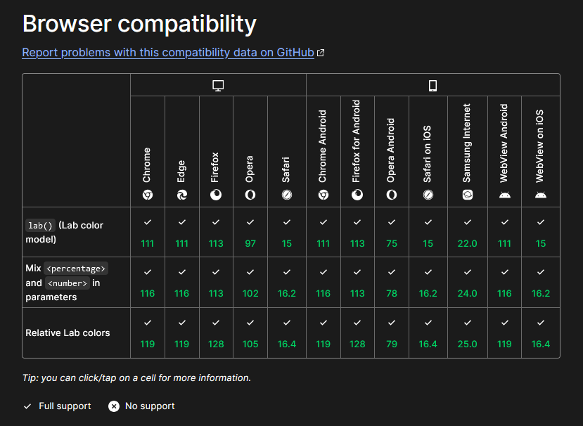
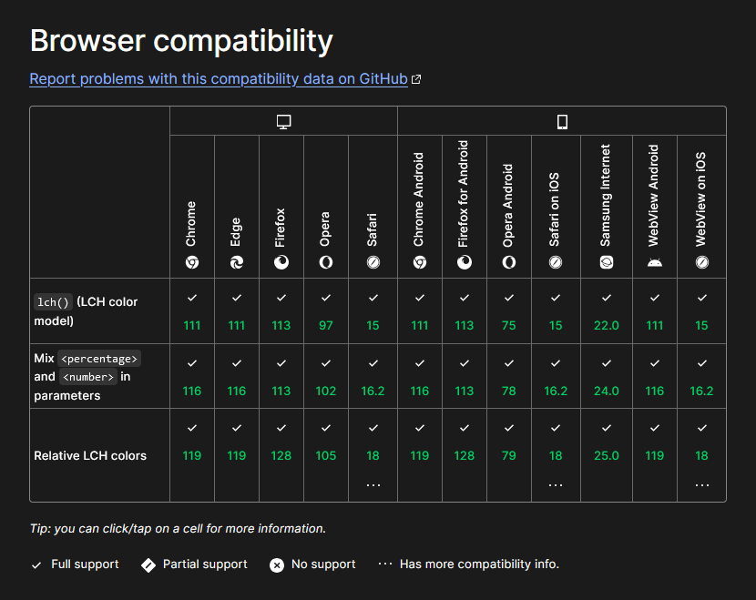

# Additional Research & Online Learning

| <a href="https://pixel-to-page-b4e4b9d4d8dd.herokuapp.com/">Live Project</a> |
  <a href="https://github.com/users/TheRickyroy/projects/3/views/1?visibleFields=%5B%22Title%22%2C%22Assignees%22%2C%22Status%22%2C%22Labels%22%5D">Project Board</a> |
  <a href="https://github.com/TheRickyroy/pixel-to-page/blob/main/README.md">README</a> |
  <a href="https://github.com/TheRickyroy/pixel-to-page/blob/main/documentation/testing.md">Testing & Validation</a> |

## Table of Contents  
  
- [Additional Research & Online Learning](#additional-research--online-learning)
  - [Table of Contents](#table-of-contents)
- [Content & Inspiration](#content--inspiration)
  - [Bullet Journal & Blogs](#bullet-journal--blogs)
  - [Additional Reading](#additional-reading)
- [Color](#color)
  - [Color Contrast](#color-contrast)
  - [Color Space](#color-space)

<a href="#additional-research--online-learning">🔺 Back To Top</a>

## Content & Inspiration

### Bullet Journal & Blogs

- [Bullet Journal](https://bulletjournal.com/)

- [Your Visual Journal](https://yourvisualjournal.com/bullet-journal-bloggers/) - 12 Bullet Journal Bloggers who can help take your bujo to the next level
  - [Journal With Purpose](https://www.journalwithpurpose.co.uk/)
  - [Little Coffee Fox](https://littlecoffeefox.com/)
  - [Little Miss Rose](https://littlemissrose.com/)
  - [Masha Plans](https://mashaplans.com/)
  - [Life is Messy & Brilliant](https://lifeismessyandbrilliant.com/)
  - [Planning Mindfully](https://www.planningmindfully.com/)
  - [Diary of a Journal Planner](https://diaryofajournalplanner.com/)
  - [Your Visual Journal](https://yourvisualjournal.com/)

- [The Lasy Genuis Collective](https://www.thelazygeniuscollective.com/blog/how-to-bullet-journal) - How to Bullet Journal: The Absolute Ultimate Guide
- [The Paper Kind](https://thepaperkind.com/2020/01/25/how-i-use-a-bullet-journal-to-manage-my-blog/) - How I Use A Bullet Journal To Manage My Blog
- [Diary of a Journal Planner](https://diaryofajournalplanner.com/bullet-journal-bloggers/) - The Best Bullet journal bloggers To Follow
  - Planning & Bullet Journal Blogs
    - [Little Miss Rose](https://littlemissrose.com/)
    - [The Petite Planner](https://thepetiteplanner.com/)
    - [Page Flutter](https://pageflutter.com/)
    - [Little Coffee Fox](https://littlecoffeefox.com/)
    - [Tiny Ray of Sunshine](https://www.tinyrayofsunshine.com/)
    - [Sheena of the Journal](https://www.sheenaofthejournal.com/)
    - [Life is Messy & Brilliant](https://lifeismessyandbrilliant.com/)
  - Time Management & Personal Development
    - [Planning Mindfully](https://www.planningmindfully.com/)
    - [The Goal Chaser](https://thegoalchaser.com/)
    - [A Pen and A Purpose](https://apenandapurpose.com/)
    - [Anja Home](https://anjahome.com/)
    - [Square Lime Designs](https://squarelimedesigns.com/)
  - Creative
    - [My Inner Creative](https://myinnercreative.com/)
    - [Pretty Prints & Paper](https://prettyprintsandpaper.com/)
	- [Sweet PlanIt](https://www.sweetplanit.com/)
	- [Compass and Ink](https://compassandink.com/)
  - Minimal Bullet Journal Websites
	- [Wellella](https://wellella.com/)
	- [Plan Another Day](https://plananotherday.com/)
	- [Rediscover Analog](https://rediscoveranalog.com/)
  - Planner Bloggers
	- [Space And Quiet](https://spaceandquiet.com/)
	- [101 Planners](https://www.101planners.com/)
	- [All About Planners](https://allaboutplanners.com.au/)
	- [Best Personal Planner](https://bestpersonalplanner.com/)
  - Bullet Journal Planner YouTube
	- [My Life in a Bullet](https://www.youtube.com/channel/UCDbfjlTzm8GJSOafKZgz7ig/featured)
	- [Planning With Kay](https://www.youtube.com/planningwithkay)
	- [Sarica Studio](https://www.youtube.com/channel/UCJbrmbl6ytY0Ui51HMFdOgg)
	- [Jann Plans Things](https://www.youtube.com/channel/UCmU4UQaW_pkWxw_uq-vnFPg)
	- [Amanda Rach Lee](https://www.youtube.com/channel/UCk9aeo2A6a1fg3VeRueTn9w)

- [Gwennan Rees](https://www.gwennanrees.com/blog/the-ultimate-bullet-journal-resources-list) - The Ultimate Bullet Journal Resources List
	- Tips & Tricks On Starting & Using Your Journal
		- [Tiny Ray of Sunshine](https://www.tinyrayofsunshine.com/)
		- [Bullet Journal](https://bulletjournal.com/)
		- [Lazy Thoughts](https://www.lazythoughts.co.uk/)
		- [Buzzfeed](https://www.buzzfeed.com/rachelwmiller/how-to-start-a-bullet-journal?utm_term=.ko01x8kgJw#.yy7n2pPY0K) - WTF Is A Bullet Journal And Why Should You Start One? An Explainer

- [Bullet Journal Junkie](https://bulletjournaljunkie.com)

- [Katie Codes](https://ksylor.github.io/2020/08/26/bullet-journaling.html) - Bullet journalling for software engineers (and other not-necessarily-artistic people)

<a href="#additional-research--online-learning">🔺 Back To Top</a>

### Additional Reading

- Austin Kleon _(2012)_ [Steal Like An Artist: 10 Things Nobody Told You About Being Creative](https://amzn.eu/d/5g8UaG8)
- Austin Kleon _(2014)_ [Show Your Work: 10 Ways To Share Your Creativity And Get Discovered](https://amzn.eu/d/aMSMJP2)
- Austin Kleon _(2019)_ [Keep Going: 10 ways To Stay Creative In Good Times And Bad](https://amzn.eu/d/73OxGBY)
- Jesse J. Anderson _(2023)_ [Extra Focus: The Quick Start Guide To Adult ADHD ](https://amzn.eu/d/80hLTWm)
- Kirsten Burke _(2018)_ [Secrets of Modern Calligraphy: An inspirational workbook to develop your lettering skills, with 7 exclusive art cards to pull out and treasure.](https://amzn.eu/d/6S5QtuF)
- Ryder Carroll _(2018)_ [The Bullet Journal Method](https://amzn.eu/d/3dHmy4G)
- Thy Doan Graves _(2017)_ [Hand Lettering Handbook: Creative Alphabets for Any Occasion](https://amzn.eu/d/2LGJjW4)

<a href="#additional-research--online-learning">🔺 Back To Top</a>

## Color

### Color Contrast

>If your website isn’t ADA accessible, you are liable for the following:
>
>First-time violation: $55,000 – $75,000 fine\
>Repeat violations: $150,000 fine
>
>>Lawsuits aren’t unheard of — here are a few companies that have already been named in lawsuits, include:\
>>Amazon, Hershey’s, The Wall Street Journal, Rite Aid, H&R Block, Teachers Test Prep
>
>[WebFX](https://www.webfx.com/blog/marketing/what-is-ada-compliance/#:~:text=ADA%20compliance%20refers%20to%20the%20Americans%20with%20Disabilities%20Act%20Standards,accessible%20to%20people%20with%20disabilities.)

**Reading Material**

- [A Checks](https://www.achecks.org/apca-accessible-colour-contrast-checker/) - APCA Accessible Colour Contrast Checker
- [WebFX](https://www.webfx.com/blog/marketing/what-is-ada-compliance/#:~:text=ADA%20compliance%20refers%20to%20the%20Americans%20with%20Disabilities%20Act%20Standards,accessible%20to%20people%20with%20disabilities.) - What Is ADA Compliance ANd How Do I Make My Website Compliant?
- [Toptal](https://www.toptal.com/designers/colorfilter/) - Colorblind Web Page Filter Testing Tool & Simulator

<a href="#additional-research--online-learning">🔺 Back To Top</a>

### Color Space

>Personally, I'm using HSL. In the coming months, I plan on migrating to OKLCH, but it feels just a bit too bleeding-edge at the moment.
>
> [Josh W Comeau](https://www.joshwcomeau.com/css/color-formats/)

> But, that being said, OKLCH comes with two challenges:
>
> With OKLCH and LCH, not all combinations of L, C, and H will result in colors that are supported by every monitor. Although browsers will try to find the closest supported color, it’s still safer to check colors using our color picker.
>
>OKLCH is a new color space. At the time of this writing in 2024, its ecosystem is still limited (for Figma we have the plugin but not official support), but we already have a palette generator, color picker, and many converters.
>
>[Evil Martians](https://evilmartians.com/chronicles/oklch-in-css-why-quit-rgb-hsl)

 

MDN Web Docs - lab()

[mdn web docs_lab()](https://developer.mozilla.org/en-US/docs/Web/CSS/color_value/lab)

 

MDN Web Docs - lch()

[mdn web docs_lch()](https://developer.mozilla.org/en-US/docs/Web/CSS/color_value/lch)

 

**Reading Material**

- Atoms - [LCH is the best color space for UI](https://atmos.style/blog/lch-color-space)
- Atmos - [HEX to LCH Color Converter](https://atmos.style/color-converter/hex-to-lch)
- Can I Use - [LCH and Lab color values](https://caniuse.com/css-lch-lab)
- Evil Martians - [OKLCH in CSS: why we moved from RGB and HSL](https://evilmartians.com/chronicles/oklch-in-css-why-quit-rgb-hsl)
- Josh W. Comeau - [Color Formats in CSS](https://www.joshwcomeau.com/css/color-formats/)
- Lambdatest - [LCH and Lab color values](https://www.lambdatest.com/web-technologies/css-lch-lab)
- Lea Verou - [LCH colors in CSS: what, why, and how?](https://lea.verou.me/blog/2020/04/lch-colors-in-css-what-why-and-how/)
- MDN - [lab()](https://developer.mozilla.org/en-US/docs/Web/CSS/color_value/lab)
- MDN - [lch()](https://developer.mozilla.org/en-US/docs/Web/CSS/color_value/lch)
- Smashing Magazine - [A Guide To Modern CSS Colors With RGB, HSL, HWB, LAB And LCH](https://www.smashingmagazine.com/2021/11/guide-modern-css-colors/)

<a href="#additional-research--online-learning">🔺 Back To Top</a>
