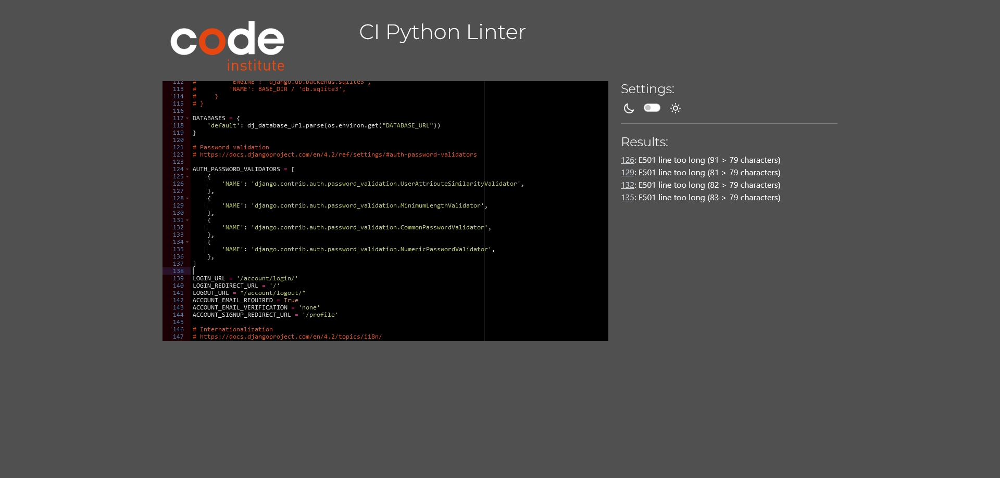
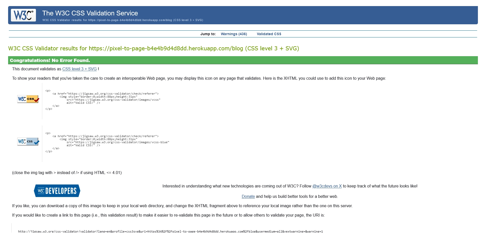
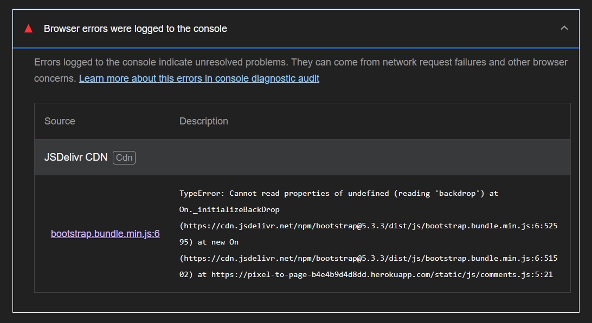
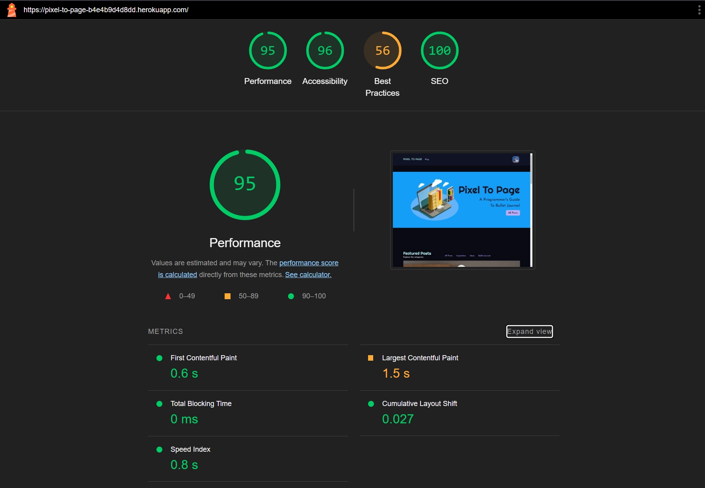
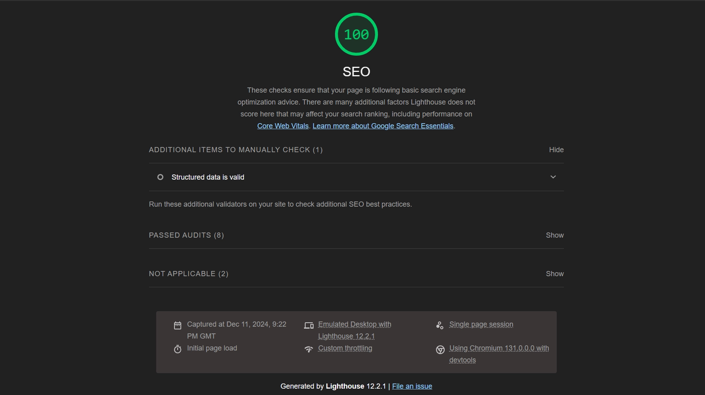
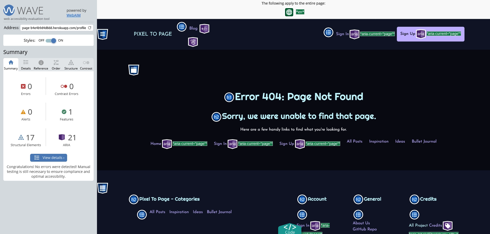

# Testing & Validation


<p align="center">
| <a href="https://pixel-to-page-b4e4b9d4d8dd.herokuapp.com/">Live Project</a> |
  <a href="https://pixel-to-page-b4e4b9d4d8dd.herokuapp.com/admin">Admin Panel</a> |
</p>
<p align="center">
 | <a href="https://github.com/TheRickyroy/pixel-to-page/blob/main/README.md">README</a> | 
  <a href="https://github.com/users/TheRickyroy/projects/3/views/1?visibleFields=%5B%22Title%22%2C%22Assignees%22%2C%22Status%22%2C%22Labels%22%5D">Project Board</a> |
  <a href="https://github.com/TheRickyroy/pixel-to-page/blob/main/documentation/testing.md">Testing</a> |
  <a href="https://github.com/TheRickyroy/pixel-to-page/blob/main/documentation/testing.md">Research</a> |
  <a href="https://github.com/TheRickyroy/pixel-to-page/blob/main/documentation/credits.md">Credits</a> |
</p>

## Table of Contents  
    
- [Testing & Validation](#testing--validation)
  - [Table of Contents](#table-of-contents)

- [Validation](#validation)
  - [HTML Validation](#html-validation)
  - [JavaScript Validation](#javascript-validation)
  - [Python Validation](#python-validation)
    - [Settings: Test 1](#settings-1)
    - [Python Validation Pass](#python-validation-pass)
  - [CSS Validation](#css-validation)
  - [Lighthouse Scores](#lighthouse-scores)
  - [Wave Accessibility Evaluation](#wave-accessibility-evaluation)

- [Manual Testing](#manual-testing)
  - [User Input/Form Validation](#user-inputform-validation)
  - [Browser Compatibility](#browser-compatibility)
  - [Testing User Stories](#testing-user-stories)
  - [Dev Tools/Real World Device Testing](#dev-toolsreal-world-device-testing)
  - [Virtual Test Environment](#virtual-test-environment)

- [Bugs](#bugs)
  - [Bug Status](#bug-status)
  - [Bugs - Additional Detail](#bugs---additional-detail)

<p align="right"><a href="#testing--validation">🔺 Back To Top</a></p>

## Validation

The following validation testing has all been conducted as using the code from the final deployed project.

This testing has been conducted has been done so in order of priority using the highest availble.

1. Tool directly extrapolates data from the deployed URL
2. Code taken from the deployed project page source
3. Code taken from the final deliverable code from the IDE workspace

<p align="right"><a href="#testing--validation">🔺 Back To Top</a></p>

## HTML Validation

Through my validation testing I came across a number of errors within my HTML. \
These errors were all resolved as part of my debug and fix process, numerous of which have been included with the [bugs](#bugs) section.

It was noted and advised by Amy that all HTML validation be done via a copy/paste method from the page source due to IDE workspace code including Django code that would throw errors upon testing. 

<details><summary>Home</summary>

<details><summary>Home</summary>


</details>

<details><summary>Home 2</summary>


</details>
</details>

<details><summary>Blog</summary>

<details><summary>Blog</summary>


</details>

<details><summary>Blog 2</summary>


</details>
</details>

<details><summary>Category Bujo</summary>


</details>

<details><summary>Category Ideas</summary>


</details>

<details><summary>Category Inspiration</summary>


</details>

<details><summary>Post Detail</summary>

<details><summary>Post Detail Error</summary>


</details>
<details><summary>Post Detail Pass</summary>


</details>
</details>

<details><summary>Profile</summary>


</details>

<details><summary>Profile Edit</summary>


</details>

<details><summary>Sign Out</summary>


</details>

<details><summary>404</summary>


</details>

<p align="right"><a href="#testing--validation">🔺 Back To Top</a></p>

## JavaScript Validation

<p align="right"><a href="#testing--validation">🔺 Back To Top</a></p>

## Python Validation

Validation of Python Code was performed using the [CI Python Linter](https://pep8ci.herokuapp.com/) as provided by Code Institute.

#### Settings: Test 1

Upon initially testing my **settings.py** file I found a number of minor errors that required correction.\
This included:
- E111 indentation is not a multiple of 4
- E501 line too long (85 > 79 characters)
- W291 trailing whitespace
- E128 continuation line under-indented for visual indent
- E122 continuation line missing indentation or outdented
- E501 line too long
- W292 no newline at end of file

These were generally simple fixes that had resulted from copy/paste or auto linting being set incorrectly to use two space tab.\
I did however find myself slightly unsure how to reduce an overlength line after already using a continuation line.\
During stand up (2024-12-03) I asked Amy (learning facilitator) about this and was informed it was a non-issue and out of scope for the proejct.

As a follow up, Amy provided additional resources:
- Python.org - [PEP 8 – Style Guide for Python Code](https://peps.python.org/pep-0008/#indentation)
- Datacamp - [A Comprehensive Guide on How to Line Break in Python](https://www.datacamp.com/tutorial/how-to-line-break-in-python)

Using these resources for further supplemental learning I intend to return and fix this issue once my MVP deliverables have been achieved. 

<details><summary>Original Code</summary>


</details>

<details><summary>Edited Code</summary>


</details>
<br>

### Python Validation Pass

<details><summary>Blog App</summary>

<details><summary>Blog Admin</summary>


</details>

<details><summary>Blog Apps</summary>


</details>

<details><summary>Blog Context Processors</summary>


</details>

<details><summary>Blog Forms</summary>


</details>

<details><summary>Blog Models</summary>


</details>

<details><summary>Blog Tests</summary>


</details>

<details><summary>Blog URLs</summary>


</details>

<details><summary>Blog Views</summary>


</details>

</details>
<br>

<details><summary>Home App</summary>

<details><summary>Home Admin</summary>


</details>

<details><summary>Home Apps</summary>


</details>

<details><summary>Home Models</summary>


</details>

<details><summary>Home Tests</summary>


</details>

<details><summary>Home URLs</summary>


</details>

<details><summary>Home Views</summary>


</details>
</details>
<br>

<details><summary>Profiles App</summary>

<details><summary>Profiles Apps</summary>


</details>

<details><summary>Profiles Forms</summary>


</details>

<details><summary>Profiles Modeels</summary>


</details>

<details><summary>Profiles Tests</summary>


</details>

<details><summary>Profiles URLs</summary>


</details>

<details><summary>Profiles Views</summary>


</details>
</details>
<br>

<details><summary>Pixel To Page - Project</summary>

<details><summary>Project ASGI</summary>


</details>

<details><summary>Project Settings</summary>


</details>

<details><summary>Project URLs</summary>


</details>

<details><summary>Projects WSGI</summary>


</details>
</details>
<br>

<details><summary>Root Directory</summary>

<details><summary>Root ENV</summary>


</details>

<details><summary>Root Manage</summary>


</details>
</details>

<p align="right"><a href="#testing--validation">🔺 Back To Top</a></p>

## CSS Validation

Although my CSS passed validation, and pleasantly upon first submission, I did receive a large number of warnings.

These warnings related to Bootstrap inclusion, with two being the use of Bootstrap pseudo-elements for targeted styling.

As such I was unable to resolve these as part of my testing & validation process.

<details><summary>CSS Home</summary>


</details>

<details><summary>CSS Blog</summary>


</details>

<details><summary>CSS Category - Bujo</summary>


</details>

<details><summary>CSS Category - Ideas</summary>


</details>

<details><summary>CSS Category - Inspiration</summary>


</details>

<details><summary>CSS Post Detail</summary>


</details>

<details><summary>CSS Sign In</summary>


</details>

<details><summary>CSS Warnings</summary>


</details>
<p align="right"><a href="#testing--validation">🔺 Back To Top</a></p>

## Lighthouse Scores

As part of my lighthouse testing I received warnings for accessibility due ton contrast which was a point of concern.\
However due to the rigorous testing including multiple contrast checks during development, passing [WAVE Accessibility](#accessibility-evaluation) during validation testing and user feedback this was something I was comfortable with. 

Lighthouse return color contrast issues during testing, though due to rigerous testing as part of my previos contrast checks and a pass state as part of WAVE WCAG testing I felt comfortable accepting these within this report.

My main concern with the Lighthouse results were to do with the low score within best practices.\
Upon inspection the issues being presented appear to be the result of using Cloudinary and Bootstrap, which puts them out of scope of what I am able to improve upon within this project. 

<details><summary>Accessibility</summary>

<details><summary>Accessibility Score</summary>


</details>

<details><summary>Accessibility - Contrast Issue</summary>


</details>
</details>

<details><summary>Best Practices</summary>

<details><summary>Best Practices - Score</summary>


</details>

<details><summary>Best Practices - Does not use HTTPS</summary>


</details>

<details><summary>Best Practices - Uses third-party cookies</summary>


</details>

<details><summary>Best Practices - Browser errors were logged to the console</summary>


</details>

<details><summary>Best Practices - Issues were logged in the Issues panel in Chrome Devtools</summary>


</details>
</details>

<details><summary>Performance</summary>

<details><summary>Performance - Score</summary>


</details>

<details><summary>Performance - Preconnect to required origins</summary>


</details>

<details><summary>Performance - Largest Contentful Paint element</summary>


</details>

<details><summary>Performance - Enable text compression</summary>


</details>

<details><summary>Performance - Properly size images</summary>


</details>

<details><summary>Performance - Eliminate render-blocking resources</summary>


</details>
</details>

<details><summary>SEO Score</summary>


</details>

<p align="right"><a href="#testing--validation">🔺 Back To Top</a></p>

## Accessibility Evaluation

Accessibility checks were performed using the [WAVE Accessibility Evealuation Tool](https://wave.webaim.org/) and provided useful feedback for adjustments to improve the project. 

Although I received no errors, there were a number warnings, some of which I resolved, others I opted to leave. 

**Redundant Links**

Present at multiple stages of testing, I opted to leave a number of these in place.\
This decision was made due to the accepted convention of titles acting as a direct link to conent but also wanting to provide a positive user experience and increased accessibility by also including a _Read More_ button.

**Overlength Alt Messages**

I did receive multiple warnings across the site, often for the same recurring images, about alt text exceeding 100 characters.\
As noted below within the details of these warnings the 100 characters is arbitary and as such not something I opted to reduce all alt text to conform too. Where possible I reduced alt text to something I felt appropriate.

I have recently been following a number of accessibility professionals on [Bluesky](https://bsky.app/) and read through many discussions about the use of alt text and how best to approach this, many of which include lengthier descriptions as a preference. This topic is one that is very prominent currently with Bluesky offering user settings to prevent upload of images without alt text to improve accessibility, and is something I plan to learn much more about in the near future.

>The Algorithm... in English
>
> The image's alt attribute value is more than 100 characters. Note that the 100 character limit is a rough and somewhat arbitrary length. For images that present complex content or lengthy text, alternative text longer than 100 characters may be appropriate.
>
> [WAVE Web Accessibility Evaluation Tool](https://wave.webaim.org/report#/https://pixel-to-page-b4e4b9d4d8dd.herokuapp.com/)

**Duplicated Alt Text**

This duplication was the result of the post author profile image alt text being set as `{{ post.user.profile.get_display_name }}` which was directly follwed by the same information for displaying the author name. This was fixed by amending to `{{ post.user.profile.get_display_name }} Author's Profile Image`

**After Post CTA Post Titles**

The call to action for linking to previous and next posts within the post detail view,  as with the author alt image initially used the same information for both. I then changed the titles to 'Previous Post' and 'Next Post'
- ``
- 

**Heading Level**
The result of templating I initially had `<h2>` which was then altered to `<h1>` as required.

<details><summary>WAVE Accessibility</summary>

<details><summary>Home</summary>


</details>

<details><summary>Blog</summary>


</details>

<details><summary>Category</summary>


</details>

<details><summary>Post Detail</summary>


</details>

<details><summary>Sign In</summary>


</details>

<details><summary>Error 404</summary>


</details>

</details>
<br>

I have included [Toptal Colorblind](https://www.toptal.com/designers/colorfilter/) results for a visual representation and understanding of how these may impact accessibility for users. Although all contrast compliance has been met and Toptal doesn't provide quantifiable data, it is a valuable resource for checking potential issues for users throughout the development process, as well as image selection for content after delivery. 

<details><summary>Toptal Colorblind Filter</summary>

<details><summary>Home</summary>


</details>

<details><summary>Blog</summary>


</details>

</details>

<p align="right"><a href="#testing--validation">🔺 Back To Top</a></p>

## Manual Testing


### Device List

### User Input/Form Validation

<p align="right"><a href="#testing--validation">🔺 Back To Top</a></p>

### Browser Compatibility

<p align="right"><a href="#testing--validation">🔺 Back To Top</a></p>

### Testing User Stories

<p align="right"><a href="#testing--validation">🔺 Back To Top</a></p>

### Dev Tools/Real World Device Testing

<p align="right"><a href="#testing--validation">🔺 Back To Top</a></p>

### Virtual Test Environment

Using [statcounter](https://gs.statcounter.com/screen-resolution-stats) to attain the latest (_October 2024_) usage stats, I compiled a virtual testing environment using [Responsive Viewer](https://chromewebstore.google.com/detail/responsive-viewer/inmopeiepgfljkpkidclfgbgbmfcennb?hl=en) with the six most popular worldwide screen resolutions. Although the most popular resolution globally is **1920x1080**, the [data](https://gs.statcounter.com/platform-market-share/desktop-mobile-tablet) shows usage stats for **61.63% - Mobile**, **36.52% - Desktop** and the remaining **1.85% - Tablet**, thus reinforcing a mobile first approach to responsive design and UX.

| Rank | Resolution | Global Usage |
| :--: | :--: | --: |
| 1 | 1920x1080 | 9.24% |
| 2 | 350x800 | 6.77% |
| 3 | 375x812 | 4.63% |
| 4 | 390x844 | 4.49% |
| 5 | 1366x768 | 4.28% |
| 6 | 1536x864 | 4.15% |

<p align="right"><a href="#testing--validation">🔺 Back To Top</a></p>

## Bugs

This being my first Full Stack Project, I anticipated running into bugs and issues throughout the process.\
Though they caused difficulties at times, they have also offered up ample learning opportunity for debugging and grasping a better understanding of the core concepts and implementations required for developing a project such as _Pixel To Page_.


For future reference, I chose to fully document all bugs encountered and the steps taken during the debugging process.\
By doing so I hope to continue developing my understanding and thus increase my efficiency by having effective solutions to refer back to, but just as importantly, failed solutions to potentially avoid in future.\
As note a lot of these bugs were the result of trial and error / experimentation as part of my learning process and as such are not reflective of a development process using best practices and as such would not be encountered in many cases.

### Bug Status

This table can be used to identify all bugs throughout the project including their solution status.\
Additional details about each bug, including screenshots, resolution steps and potential future solutions can be found [here](#bugs---additional-detail).

<details>
<summary>Bug Status Key</summary>

| ID | Status | 
|:-:|:-|
| 🔴 | Unresolved | 
| 🟡 | Partially Resolved | 
| 🟢 | Fully Resolved | 

</details>

| No. | Bug | Status | Solution Credit | Commit no. |
| :--: | :-- | :--: | :-- | --: |
| 1 | Database Migration - Syntax Error | 🟢 | Bash Terminal Error | [ef4ef38](https://github.com/TheRickyroy/pixel-to-page/commit/ef4ef3867d31ea2762afa447bfe4ef8849102eb9) |
| 2 | Database Migration - Syntax Error | 🟢 | Bash Terminal Error | [ef4ef38](https://github.com/TheRickyroy/pixel-to-page/commit/ef4ef3867d31ea2762afa447bfe4ef8849102eb9) |
| 3 | Heroku Application Error | 🟢 | Debugging & Slack Coding Coach Channel | [f1efeb0](https://github.com/TheRickyroy/pixel-to-page/commit/f1efeb0e2f6fe703e79bf5fdab7953d8ed85f6ce) |
| 4 | Procfile - Syntax Error | 🟢 | Identified as part of Bug #3 | [aa63bd6](https://github.com/TheRickyroy/pixel-to-page/commit/aa63bd6bd083caf5125419e8955d9354af4d07c8) |
| 5 | Commit Push Failure | 🟢 | [Sakshi Rathore - Medium](https://medium.com/@rajlaxmii/git-error-you-have-divergent-branches-and-need-to-specify-how-to-reconcile-them-75e97bd8abd2) & [Kenny DuMez - Graphite](https://graphite.dev/guides/understanding-your-branch-is-ahead-of-origin-main-by-1-commit) | [923e65f](https://github.com/TheRickyroy/pixel-to-page/commit/923e65fcb58a6436f1f6540841b7aac3c78fe630) |
| 6 | Admin Panel Access | 🟢 | Debugging within development workspace | [a3ddfb1](https://github.com/TheRickyroy/pixel-to-page/commit/a3ddfb1d34ea27d541b7b9f8dbd2b0849b64d204) |
| 7 | Post Title Links | 🟢 | Debugging within development workspace | [a3ddfb1](https://github.com/TheRickyroy/pixel-to-page/commit/a3ddfb1d34ea27d541b7b9f8dbd2b0849b64d204) |
| 8 | Comment Code Inclusion | 🟢 | Mark Briscoe - SME Session | [630d636](https://github.com/TheRickyroy/pixel-to-page/commit/630d63681624cd2e2e5498e50523a58d3cbf9ee9) |
| 9 | Bash Terminal Overwriting | 🟢 | Debugging | N/A |
| 10 | Blog Link Active State | 🟢 | Debugging | [af42261](https://github.com/TheRickyroy/pixel-to-page/commit/af422619027383d8601d41706353e507879c520f) |
| 11 | Deployed CSS Styling | 🟢 | Roo MacArthur - Slack Coding Coach Channel | [4a38412](https://github.com/TheRickyroy/pixel-to-page/commit/4a384126a85f6ed7d9b680af36c193496658f90e) & [9c4d1de](https://github.com/TheRickyroy/pixel-to-page/commit/9c4d1deeb09a9b67d4b6e9dec8accf03b6829903) |
| 12 | Footer Position | 🟢 | [Radu](https://radu.link/make-footer-stay-bottom-page-bootstrap/) | [e04fdb9](https://github.com/TheRickyroy/pixel-to-page/commit/e04fdb9c7d652469b8658a37031875ac70db079f) |
| 13 | Blog & Category Slugs  | 🟢 | Debugging & Roo MacArthur - Slack Coding Coach Channel | [1032cff](https://github.com/TheRickyroy/pixel-to-page/commit/1032cffec8b7347a93132d0892f72b8cf152e869) |
| 14 | Category Navigation Population | 🟢 | [Sarah Hudaib - Dev.to](https://dev.to/sarahhudaib/context-processors-in-django-15h2) | [53f2bbb](https://github.com/TheRickyroy/pixel-to-page/commit/53f2bbbdd0278efcf524d04d510c0e505a680ed1) |
| 15 | Comment CRUD Functionality | 🟢 | [Credited Source](Link) | [Commit](Link) |
| 16 | Info Section Active State | 🟢 | [Credited Source](Link) | [Commit](Link) |
| 17 | Django Objects Continuation Line | 🟢 | [Credited Source](Link) | [Commit](Link) |
| 18 | Bootstrap Guttering | 🟢 | [Credited Source](Link) | [Commit](Link) |
| 19 | Button Text 'Padding' | 🟢 | [Credited Source](Link) | [Commit](Link) |
| 20 | Signup CTA Not Displaying | 🟢 | [Credited Source](Link) | [Commit](Link) |
| 21 | Navbar Styling | 🟢 | [Credited Source](Link) | [Commit](Link) |
| 22 | Author Image Padding | 🟢 | [Credited Source](Link) | [Commit](Link) |
| 23 | Profile Image - Logged In State | 🟢 | [Credited Source](Link) | [Commit](Link) |
| 24 | Default Profile Image | 🟢 | [Credited Source](Link) | [Commit](Link) |
| 25 | User Display Name | 🟢 | [Credited Source](Link) | [Commit](Link) |
| 25-2 | Failed Deployment | 🟢 | [Credited Source](Link) | [Commit](Link) |
| 26 | Placeholder Text Not Removed | 🟢 | [Credited Source](Link) | [Commit](Link) |
| 27 | Button URL Failure | 🟢 | [Credited Source](Link) | [Commit](Link) |
| 28 | Button Incorrect Object | 🟢 | [Credited Source](Link) | [Commit](Link) |
| 29 | Home Page Section Overlap | 🟢 | [Credited Source](Link) | [Commit](Link) |
| 30 | Profile Page Responsivity | 🟢 | [Credited Source](Link) | [Commit](Link) |
| 31 | Edit Profile Styling | 🟢 | [Credited Source](Link) | [Commit](Link) |
| 32 | Home Page Section Overlap | 🟢 | [Credited Source](Link) | [Commit](Link) |
| 33 | AllAuth Page Styling | 🟢 | [Credited Source](Link) | [Commit](Link) |
| 34 | Losing Styling On Deployment | 🟢 | [Credited Source](Link) | [Commit](Link) |

<p align="right"><a href="#testing--validation">🔺 Back To Top</a></p>

### Bugs - Additional Detail

<details><summary>Bug #1 - Database Migration - Syntax Error</summary>

Commit [ef4ef38](https://github.com/TheRickyroy/pixel-to-page/commit/ef4ef3867d31ea2762afa447bfe4ef8849102eb9)

After attempting to migrate the database I received an indentation error within the terminal. 
This was the result of pasting the required code from the Django Setup & Deployment document and it losing the correct indentation in the process. 

`Indentation Error: expected an indented block after 'if' statement on line 16`


Thanks to the terminal identifying this error it was a simple fix adding the correct indentation of two spaces on line 17 and repeating the migration command.

`python3 manage.py migrate`

</details>

<details><summary>Bug #2 - Database Migration - Syntax Error</summary>

Commit [ef4ef38](https://github.com/TheRickyroy/pixel-to-page/commit/ef4ef3867d31ea2762afa447bfe4ef8849102eb9)

Following the debugging of Bug #1 the bach terminal returned an additional syntax error. 

This was a rogue `-` on line 43 of **settings.py** which was accidentally typed in whilst making notes on the deployment process for the **README** docs whilst the IDE Workspace was still my active window. 

</details>

<details><summary>Bug #3 - Heroku Application Error</summary>

Commit [f1efeb0](https://github.com/TheRickyroy/pixel-to-page/commit/f1efeb0e2f6fe703e79bf5fdab7953d8ed85f6ce)

Application error returned upon deploying the app in Heroku.


Attempted to run server from IDE thus identifying error in terminal


Corrected cloudinary environ in **env.py** file after incorrect copy and paste from API & Heroku.

I also updated method to `setdefaul()` as oppose to assigning the value as per LMS.


Before submitting a support request I checked through the channel and found another student had already sought out a solution which reminded me to set `DEBUG = True` as it was still set to False from my deployment attempt. 

After double checking through all steps I also realised I had missed a step in adding to the **blog** **views.py**

During the debugging process I also identified Bug #4 which was resolved prior to this bug closure. 

</details>

<details><summary>Bug #4 - Procfile Syntax</summary>

Commit [aa63bd6](https://github.com/TheRickyroy/pixel-to-page/commit/aa63bd6bd083caf5125419e8955d9354af4d07c8)

Project name identified to be using wrong sytnax in **Procfile** as part of Bug #3 debugging process.

Incorrect - `web: gunicorn pixel-to-page.wsgi`\
Correct - `web: gunicorn pixel_to_page.wsgi`

</details>

<details><summary>Bug #5 - Commit Push Failure</summary>

Commit [923e65f](https://github.com/TheRickyroy/pixel-to-page/commit/923e65fcb58a6436f1f6540841b7aac3c78fe630)

**Identification**

Discussion during guided session highlighted **runtime.txt** requirement absent from the walkthrough documentation, but present within the LMS.

Upon creation of this file I attempted a `git add .` `git commit` and `git push` at which point I received an error in the terminal.

**Resolution**

`git pull main`
```
fatal: 'main' does not appear to be a git repository
fatal: Could not read from remote repository.

Please make sure you have the correct access rights
and the repository exists.
```

`git pull`
```
hint: You have divergent branches and need to specify how to reconcile them.
hint: You can do so by running one of the following commands sometime before
hint: your next pull:
hint:
hint:   git config pull.rebase false  # merge
hint:   git config pull.rebase true   # rebase
hint:   git config pull.ff only       # fast-forward only
hint:
hint: You can replace "git config" with "git config --global" to set a default
hint: preference for all repositories. You can also pass --rebase, --no-rebase,
hint: or --ff-only on the command line to override the configured default per
hint: invocation.
fatal: Need to specify how to reconcile divergent branches.
```

Sourced a possible [solution](https://medium.com/@rajlaxmii/git-error-you-have-divergent-branches-and-need-to-specify-how-to-reconcile-them-75e97bd8abd2)

`git pull --rebase origin main`

```
From https://github.com/TheRickyroy/pixel-to-page
 * branch            main       -> FETCH_HEAD
Successfully rebased and updated refs/heads/main.
```

`git status`
```
On branch main
Your branch is ahead of 'origin/main' by 1 commit.
  (use "git push" to publish your local commits)

nothing to commit, working tree clean
```

Sourced actual [solution](https://graphite.dev/guides/understanding-your-branch-is-ahead-of-origin-main-by-1-commit)

`git push origin main`
```
Enumerating objects: 4, done.
Counting objects: 100% (4/4), done.
Delta compression using up to 32 threads
Compressing objects: 100% (2/2), done.
Writing objects: 100% (3/3), 342 bytes | 342.00 KiB/s, done.
Total 3 (delta 1), reused 0 (delta 0), pack-reused 0 (from 0)
remote: Resolving deltas: 100% (1/1), completed with 1 local object.
To https://github.com/TheRickyroy/pixel-to-page.git
   ff76d71..923e65f  main -> main
```

</details>

<details><summary>Bug #6 - Admin Panel Access</summary>

Commit [a3ddfb1](https://github.com/TheRickyroy/pixel-to-page/commit/a3ddfb1d34ea27d541b7b9f8dbd2b0849b64d204)

**Identification**

Upon adding the post view I was unable to access the admin panel.

**Solution**

I checked through my files and code and realised that **pixel_to_page** > **urls.py** required `path('admin/', admin.site.urls),` moving prior to `path("", include("blog.urls"), name="blog-urls"),`. 

Doing this resolved the issue and granted access to admin again within my development workspace. 

</details>

<details><summary>Bug #7 - Post Title Links</summary>

Commit [a3ddfb1](https://github.com/TheRickyroy/pixel-to-page/commit/a3ddfb1d34ea27d541b7b9f8dbd2b0849b64d204)

**Identification**
After rectifying the admin panel in bug #6 I found to I was unable to access the **post_detail** view via the title hyperlink.

**Solution**
Upon inspection of **index.html** I realised I had the original `<href>` was still in place preventing correct linking. 

Incorrect Code
```
<a href="" class="post-link"></a>
  <a href="#" class="post-link">
  <h2 class="card-title">{{ post.title }}</h2>
</a>
```

Corrected Code 
```
<a href="" class="post-link">
  <h2 class="card-title">{{ post.title }}</h2>
</a>
```

</details>

<details><summary>Bug #8 - Comment Including HTML</summary>

Commit - [630d636](https://github.com/TheRickyroy/pixel-to-page/commit/630d63681624cd2e2e5498e50523a58d3cbf9ee9)

**Identification**
Upon testing the comment CRUD functionality the body of the content included additional HTML code that was used to provide structure to the layout within the admin panel.


**Resolution**
Amended code from including linebreaks to safe. 

Incorrect code
```
<div id="comment{{ comment.id }}">
  {{ comment.body | linebreaks }}
</div>
```

```
<div id="comment{{ comment.id }}">
  {{ comment.body | safe }}
</div>
```

This solution was provided by Mark Briscoe during an SME (subject matter expert) open door coding session (2024-12-02).

</details>

<details><summary>Bug #9 - Terminal Command Overwriting</summary>

**Identification**

Whilst typing the commit message for Bug #8 the bash terminal would begin overtyping the start of the line.


**Solution**

- First Attempt - Retyping the command - produced the same result.
- Second Attempt - Starting a new bash terminal and retyping the command. - Resolved issue.

</details>

<details><summary>Bug #10 - Blog Link Active State</summary>

Commit [af42261](https://github.com/TheRickyroy/pixel-to-page/commit/)

**Identification**

Whilst adding base styling to **style.css** and adjusting for the Booststrap auto styles, I realised that the active link styling was not applying to the **Blog** link. 

Active link styling applying to **Home**\


Active link styling not applied to **Blog**\


**Solution**

After debug testing of styles for nav classes (due to prior experience struggling to override Bootstrap) I realised that the issue may be with the link and not the styling. At this point I noticed that the link wasn't being called at the head of the page and quickly resolved the issue with the addition of the required code.\

Code add
``` Python

```

Active link styling applying to **Blog**\


</details>

<details><summary>Bug #11 - Deployed CSS Styling</summary>

Commit - [4a38412](https://github.com/TheRickyroy/pixel-to-page/commit/4a384126a85f6ed7d9b680af36c193496658f90e)
Commit - [9c4d1de](https://github.com/TheRickyroy/pixel-to-page/commit/9c4d1deeb09a9b67d4b6e9dec8accf03b6829903)

**Identification**

Merged changes from **style** branch into **main** performed pull request and deployed to Heroku. 
Upon deployment the CSS styling was not being applied although it was present within the IDE workspace. 

CSS Styling - IDE Workspace


No CSS Styling - Deployed Heroku Project


**Initial debugging steps taken:**

- Ensuring DEBUG was set to false (it was)
- Redeploying the project to Heroku
- Checking Heroku config files
- Testing across various devices and broswers
- Testing as registered and unregistered users
- Reaching out to CI Coding Coaches in Slack channel

**Solution steps with Roo MacArthur:**

- Confirmed Heoku status as above
- Redeployed & observed build logs
- Opened redeployed app
  - Dev Tools > Network > [X] Disable cache
  - View Source > Inspect CSS 
    - Confirmed it was using a previous version
  - Also checked app after hard refresh and within incognito window

- Staged current branch changes for commit & push (my working local branch **style**)
- Performed collect static on local **main**
- Confirmed that **static > style.css** was not being collected into **staticfiles > style.css**
- Created **base.css** to test whether it would be collected
- Confirmed this file was collected
- Renamed **style.css > style1.css** 
- Created new **style.css** and copied across code
- Collected static files
- Confirmed new **style.css** was collected / updated
  -  At this point the renames **style1.css** was also collected
- Resolved divergent branches caused during debugging process
- Push out to remote
- Redeploy on Heroku
- Confirmed deployment had updated styling applied

Discussion regarding the cache functionality and process as a developer.\
Roo confirmed with chatGPT that the Gitpod IDE workspace was maintaining a cached version of static files. 

Provided commands to run to ensure the latest version of static files are being populated within the workspace.

`python manage.py collectstatic --clear`\
`python manage.py collectstatic`

</details>

<details><summary>Bug #12 - Footer Position</summary>

Commit - [e04fdb9](https://github.com/TheRickyroy/pixel-to-page/commit/e04fdb9c7d652469b8658a37031875ac70db079f)
Commit - [e04fdb9](https://github.com/TheRickyroy/pixel-to-page/commit/e04fdb9c7d652469b8658a37031875ac70db079f)

**Identification**

Whilst appliying styling the footer position was incorrect on the **About** page, and thus across any page without content beyond the view height. 

Footer Incorrect


Footer Correct


Though I have previously solved this on other projects, I sought out additional solutions in hope of learning a more effective method.\
Following the steps provided by Rodu - [How to Make Footer Stay at Bottom of Page with Bootstrap](https://radu.link/make-footer-stay-bottom-page-bootstrap/) I was able to implement a shorter and cleaner code solution. 

Body Classes
`<body class="d-flex flex-column min-vh-100 main-bg">`

Footer Class
`<footer class="mt-auto">`

Debug process for this was started on **docs** branch after performing merge main following Bug #11 pull request.
To avoid conflicts I continued the debug and application of styling whilst on this same branch. 

</details>

<details><summary>Bug #13 - Blog & Category Slugs</summary>

Commit - [1032cff](https://github.com/TheRickyroy/pixel-to-page/commit/1032cffec8b7347a93132d0892f72b8cf152e869)

**Identification**

After implementing categories with default image assignment and attempting to setup the relevant slugs for filtering and category pages I received the following error when linking to **Blog**

NoReverseMatch


<details><summary>Error Code</summary>

```
Environment:

Request Method: GET
Request URL: http://8000-therickyroy-pixeltopage-pqpue43ydq5.ws.codeinstitute-ide.net/blog/

Django Version: 4.2.16
Python Version: 3.12.2
Installed Applications:
['django.contrib.admin',
 'django.contrib.auth',
 'django.contrib.contenttypes',
 'django.contrib.sessions',
 'django.contrib.messages',
 'django.contrib.staticfiles',
 'cloudinary_storage',
 'cloudinary',
 'django.contrib.sites',
 'allauth',
 'allauth.account',
 'allauth.socialaccount',
 'crispy_forms',
 'crispy_bootstrap5',
 'django_summernote',
 'about',
 'blog',
 'home']
Installed Middleware:
['django.middleware.security.SecurityMiddleware',
 'whitenoise.middleware.WhiteNoiseMiddleware',
 'django.contrib.sessions.middleware.SessionMiddleware',
 'django.middleware.common.CommonMiddleware',
 'django.middleware.csrf.CsrfViewMiddleware',
 'django.contrib.auth.middleware.AuthenticationMiddleware',
 'django.contrib.messages.middleware.MessageMiddleware',
 'django.middleware.clickjacking.XFrameOptionsMiddleware',
 'allauth.account.middleware.AccountMiddleware']

Template error:
In template /workspace/pixel-to-page/blog/templates/blog/blog.html, error at line 26
   Reverse for 'post_detail' with arguments '('algorithm-of-productivity',)' not found. 1 pattern(s) tried: ['blog/(?P<category_slug>[-a-zA-Z0-9_]+)/(?P<post_slug>[-a-zA-Z0-9_]+)/\\Z']
   16 :                         <div class="card-body d-flex flex-column justify-content-between">
   17 :                             <div class="image-container">
   18 :                                 
   19 :                                 
   21 :                                 
   22 :                                 
   24 :                                     
   25 :                             </div>
   26 :                             <a href="  " class="post-link">
   27 :                                 <h2 class="card-title">{{ post.title }}</h2>
   28 :                             </a>
   29 :                             <hr>
   30 :                             <p class="card-text">
   31 :                                 {{ post.excerpt | safe }}
   32 :                             </p>
   33 :                             <hr>
   34 :                             <div class="row">
   35 :                                 <div class="col-6">
   36 :                                   <p class="post-subtitle">Author: {{ post.author }}</p>

Traceback (most recent call last):
  File "/workspace/.pip-modules/lib/python3.12/site-packages/django/core/handlers/exception.py", line 55, in inner
    response = get_response(request)
               ^^^^^^^^^^^^^^^^^^^^^
  File "/workspace/.pip-modules/lib/python3.12/site-packages/django/core/handlers/base.py", line 220, in _get_response
    response = response.render()
               ^^^^^^^^^^^^^^^^^
  File "/workspace/.pip-modules/lib/python3.12/site-packages/django/template/response.py", line 114, in render
    self.content = self.rendered_content
                   ^^^^^^^^^^^^^^^^^^^^^
  File "/workspace/.pip-modules/lib/python3.12/site-packages/django/template/response.py", line 92, in rendered_content
    return template.render(context, self._request)
           ^^^^^^^^^^^^^^^^^^^^^^^^^^^^^^^^^^^^^^^
  File "/workspace/.pip-modules/lib/python3.12/site-packages/django/template/backends/django.py", line 61, in render
    return self.template.render(context)
           ^^^^^^^^^^^^^^^^^^^^^^^^^^^^^
  File "/workspace/.pip-modules/lib/python3.12/site-packages/django/template/base.py", line 175, in render
    return self._render(context)
           ^^^^^^^^^^^^^^^^^^^^^
  File "/workspace/.pip-modules/lib/python3.12/site-packages/django/template/base.py", line 167, in _render
    return self.nodelist.render(context)
           ^^^^^^^^^^^^^^^^^^^^^^^^^^^^^
  File "/workspace/.pip-modules/lib/python3.12/site-packages/django/template/base.py", line 1005, in render
    return SafeString("".join([node.render_annotated(context) for node in self]))
                               ^^^^^^^^^^^^^^^^^^^^^^^^^^^^^^
  File "/workspace/.pip-modules/lib/python3.12/site-packages/django/template/base.py", line 966, in render_annotated
    return self.render(context)
           ^^^^^^^^^^^^^^^^^^^^
  File "/workspace/.pip-modules/lib/python3.12/site-packages/django/template/loader_tags.py", line 157, in render
    return compiled_parent._render(context)
           ^^^^^^^^^^^^^^^^^^^^^^^^^^^^^^^^
  File "/workspace/.pip-modules/lib/python3.12/site-packages/django/template/base.py", line 167, in _render
    return self.nodelist.render(context)
           ^^^^^^^^^^^^^^^^^^^^^^^^^^^^^
  File "/workspace/.pip-modules/lib/python3.12/site-packages/django/template/base.py", line 1005, in render
    return SafeString("".join([node.render_annotated(context) for node in self]))
                               ^^^^^^^^^^^^^^^^^^^^^^^^^^^^^^
  File "/workspace/.pip-modules/lib/python3.12/site-packages/django/template/base.py", line 966, in render_annotated
    return self.render(context)
           ^^^^^^^^^^^^^^^^^^^^
  File "/workspace/.pip-modules/lib/python3.12/site-packages/django/template/loader_tags.py", line 63, in render
    result = block.nodelist.render(context)
             ^^^^^^^^^^^^^^^^^^^^^^^^^^^^^^
  File "/workspace/.pip-modules/lib/python3.12/site-packages/django/template/base.py", line 1005, in render
    return SafeString("".join([node.render_annotated(context) for node in self]))
                               ^^^^^^^^^^^^^^^^^^^^^^^^^^^^^^
  File "/workspace/.pip-modules/lib/python3.12/site-packages/django/template/base.py", line 966, in render_annotated
    return self.render(context)
           ^^^^^^^^^^^^^^^^^^^^
  File "/workspace/.pip-modules/lib/python3.12/site-packages/django/template/defaulttags.py", line 238, in render
    nodelist.append(node.render_annotated(context))
                    ^^^^^^^^^^^^^^^^^^^^^^^^^^^^^^
  File "/workspace/.pip-modules/lib/python3.12/site-packages/django/template/base.py", line 966, in render_annotated
    return self.render(context)
           ^^^^^^^^^^^^^^^^^^^^
  File "/workspace/.pip-modules/lib/python3.12/site-packages/django/template/defaulttags.py", line 471, in render
    url = reverse(view_name, args=args, kwargs=kwargs, current_app=current_app)
          ^^^^^^^^^^^^^^^^^^^^^^^^^^^^^^^^^^^^^^^^^^^^^^^^^^^^^^^^^^^^^^^^^^^^^
  File "/workspace/.pip-modules/lib/python3.12/site-packages/django/urls/base.py", line 88, in reverse
    return resolver._reverse_with_prefix(view, prefix, *args, **kwargs)
           ^^^^^^^^^^^^^^^^^^^^^^^^^^^^^^^^^^^^^^^^^^^^^^^^^^^^^^^^^^^^
  File "/workspace/.pip-modules/lib/python3.12/site-packages/django/urls/resolvers.py", line 828, in _reverse_with_prefix
    raise NoReverseMatch(msg)
    ^^^^^^^^^^^^^^^^^^^^^^^^^

Exception Type: NoReverseMatch at /blog/
Exception Value: Reverse for 'post_detail' with arguments '('algorithm-of-productivity',)' not found. 1 pattern(s) tried: ['blog/(?P<category_slug>[-a-zA-Z0-9_]+)/(?P<post_slug>[-a-zA-Z0-9_]+)/\\Z']

```

</details>

**Initial debugging steps taken:**

- Checked **admin.py**, **models.py** and **views.py** reflected the addition of slug to category model.
- Attempted debugging steps and searching previous solutions within Slack.
- Used Perplexity.AI to help provide non-code based diagnose and guidance for potential debugging steps.
- Reached out within Slack Coding Coach

**Solution steps with Roo MacArthur:**

- Roo provdied updated slug that hadn't been implemented within **blog.html**\
``

- I realised at this point that I hadn't actually run the migration since the addition of slug to category and that this would cause an issue and suggested zeroing out the data. 

Slack Conversation


- At this point Roo and I joined a VC call to discuss the solution process. 
- Attempted to run migration knowing it would fail, more as a debug step for learning.
- Migration was unable to complete due to the lack of default for previously assigned object data. 
- This took us into a discussion regarding improved working practices, using the **db.sqlite3** as part of the development workspace and maintaining the **postgreSQL** for production only. 
- As a result of this debugging process, and to further my learning of improved practices I;
  - Deleted all current migrations as part of the **blog** app
  - Performed `python manage.py migrate blog zero` (although redundant due to next step, this was more for practice)
  - Setup a fresh **postgreSQL** database, linked in **env.py** and Heroku
  - Began working on the **db.sqlite3** within development workspace

</details>

<details><summary>Bug #14 - Category Navigation Population</summary>

Commit: [53f2bbb](https://github.com/TheRickyroy/pixel-to-page/commit/53f2bbbdd0278efcf524d04d510c0e505a680ed1)

**Identification**

After implementing the category dropdown list and testing (pre-styling) it was functioning on the blog / category pages, but only displayed **All Posts** on the home and about page 

Blog - Category Populated\


About - Category Unpopulated\


**Solution**

My first consideration concluded in realising the home and about apps were not connected to the category model and were unable to populate the list based on the code within **base.html**

``` Python

    <li><a class="dropdown-item" href="">{{ category }}</a></li>

```

- I considered possibilities for how to achieve this in the most streamlined way following the DRY principle and avoiding duplicating code.
- Upon searching for solutions I found relevant information regarding the use of [context processors](https://dev.to/sarahhudaib/context-processors-in-django-15h2).
- After following the steps detailed within the post I returned a 'ModuleNotFoundError'

ModuleNotFound\


<details><summary>Error Code</summary>

```
Environment:

Request Method: GET
Request URL: http://8000-therickyroy-pixeltopage-pqpue43ydq5.ws.codeinstitute-ide.net/

Django Version: 4.2.16
Python Version: 3.12.2
Installed Applications:
['django.contrib.admin',
 'django.contrib.auth',
 'django.contrib.contenttypes',
 'django.contrib.sessions',
 'django.contrib.messages',
 'django.contrib.staticfiles',
 'cloudinary_storage',
 'cloudinary',
 'django.contrib.sites',
 'allauth',
 'allauth.account',
 'allauth.socialaccount',
 'crispy_forms',
 'crispy_bootstrap5',
 'django_summernote',
 'about',
 'blog',
 'home']
Installed Middleware:
['django.middleware.security.SecurityMiddleware',
 'whitenoise.middleware.WhiteNoiseMiddleware',
 'django.contrib.sessions.middleware.SessionMiddleware',
 'django.middleware.common.CommonMiddleware',
 'django.middleware.csrf.CsrfViewMiddleware',
 'django.contrib.auth.middleware.AuthenticationMiddleware',
 'django.contrib.messages.middleware.MessageMiddleware',
 'django.middleware.clickjacking.XFrameOptionsMiddleware',
 'allauth.account.middleware.AccountMiddleware']


Traceback (most recent call last):
  File "/workspace/.pip-modules/lib/python3.12/site-packages/django/core/handlers/exception.py", line 55, in inner
    response = get_response(request)
               ^^^^^^^^^^^^^^^^^^^^^
  File "/workspace/.pip-modules/lib/python3.12/site-packages/django/core/handlers/base.py", line 220, in _get_response
    response = response.render()
               ^^^^^^^^^^^^^^^^^
  File "/workspace/.pip-modules/lib/python3.12/site-packages/django/template/response.py", line 114, in render
    self.content = self.rendered_content
                   ^^^^^^^^^^^^^^^^^^^^^
  File "/workspace/.pip-modules/lib/python3.12/site-packages/django/template/response.py", line 92, in rendered_content
    return template.render(context, self._request)
           ^^^^^^^^^^^^^^^^^^^^^^^^^^^^^^^^^^^^^^^
  File "/workspace/.pip-modules/lib/python3.12/site-packages/django/template/backends/django.py", line 61, in render
    return self.template.render(context)
           ^^^^^^^^^^^^^^^^^^^^^^^^^^^^^
  File "/workspace/.pip-modules/lib/python3.12/site-packages/django/template/base.py", line 173, in render
    with context.bind_template(self):
    ^^^^^^^^^^^^^^^^^^^^^^^^^^^^^^^^
  File "/home/gitpod/.pyenv/versions/3.12.2/lib/python3.12/contextlib.py", line 137, in __enter__
    return next(self.gen)
           ^^^^^^^^^^^^^^
  File "/workspace/.pip-modules/lib/python3.12/site-packages/django/template/context.py", line 251, in bind_template
    processors = template.engine.template_context_processors + self._processors
                 ^^^^^^^^^^^^^^^^^^^^^^^^^^^^^^^^^^^^^^^^^^^
  File "/workspace/.pip-modules/lib/python3.12/site-packages/django/utils/functional.py", line 57, in __get__
    res = instance.__dict__[self.name] = self.func(instance)
                                         ^^^^^^^^^^^^^^^^^^^
  File "/workspace/.pip-modules/lib/python3.12/site-packages/django/template/engine.py", line 116, in template_context_processors
    return tuple(import_string(path) for path in context_processors)
           ^^^^^^^^^^^^^^^^^^^^^^^^^^^^^^^^^^^^^^^^^^^^^^^^^^^^^^^^^
  File "/workspace/.pip-modules/lib/python3.12/site-packages/django/template/engine.py", line 116, in <genexpr>
    return tuple(import_string(path) for path in context_processors)
                 ^^^^^^^^^^^^^^^^^^^
  File "/workspace/.pip-modules/lib/python3.12/site-packages/django/utils/module_loading.py", line 30, in import_string
    return cached_import(module_path, class_name)
           ^^^^^^^^^^^^^^^^^^^^^^^^^^^^^^^^^^^^^^
  File "/workspace/.pip-modules/lib/python3.12/site-packages/django/utils/module_loading.py", line 15, in cached_import
    module = import_module(module_path)
             ^^^^^^^^^^^^^^^^^^^^^^^^^^
  File "/home/gitpod/.pyenv/versions/3.12.2/lib/python3.12/importlib/__init__.py", line 90, in import_module
    return _bootstrap._gcd_import(name[level:], package, level)
           ^^^^^^^^^^^^^^^^^^^^^^^^^^^^^^^^^^^^^^^^^^^^^^^^^^^^
  File "<frozen importlib._bootstrap>", line 1387, in _gcd_import
    <source code not available>
               ^^^^^^^^^^^^^^^^^^^^^^^^^^^^^^^^^
  File "<frozen importlib._bootstrap>", line 1360, in _find_and_load
    <source code not available>
                           ^^^^^^^^^^^^^^^^^^^^^^^^^^^^^^^^^^^^^^
  File "<frozen importlib._bootstrap>", line 1310, in _find_and_load_unlocked
    <source code not available>
                ^^^^^^^^^^^^^^^^^^^^^^^^^^^^^^^^^^^^^^^^^^
  File "<frozen importlib._bootstrap>", line 488, in _call_with_frames_removed
    <source code not available>
               ^^^^^^^^^^^^^^^^
  File "<frozen importlib._bootstrap>", line 1387, in _gcd_import
    <source code not available>
               ^^^^^^^^^^^^^^^^^^^^^^^^^^^^^^^^^
  File "<frozen importlib._bootstrap>", line 1360, in _find_and_load
    <source code not available>
                           ^^^^^^^^^^^^^^^^^^^^^^^^^^^^^^^^^^^^^^
  File "<frozen importlib._bootstrap>", line 1324, in _find_and_load_unlocked
    <source code not available>
            ^^^^^^^^^^^^^^^^^^^^^^^^^^^^^^^^^^^^^^^^^^^^^^^^^^^^^^^^^^^^^^^^^^

Exception Type: ModuleNotFoundError at /
Exception Value: No module named 'utils'
```

</details><br>

- I took a moment to go through and double check the steps against my implementation to confirm I had done everything correctly. 
- I deduced that the initial step creating the **utils** folder in your project. was referring to the root directory, not the **Pixel To Page** project config folder and upon moving the folder it resolved my issues immediately. 
- I also realised this was essentially creating a utils app, which seemed unnecessary if I could include **context_processor** as part of the blog app itself. 
- I made this change and the fix continued to work, thus reducing the requirement of an additional app
- I am sure that the addition of the utils app is possibly considered bet practice, and would be something I use as I gain a better understanding of working practices, but for the purpose of my own learning I chose this option. 

</details>

<details><summary>Bug # - </summary>

Commit: []()

**Identification**

**Solution**

</details>

<p align="right"><a href="#testing--validation">🔺 Back To Top</a></p>


